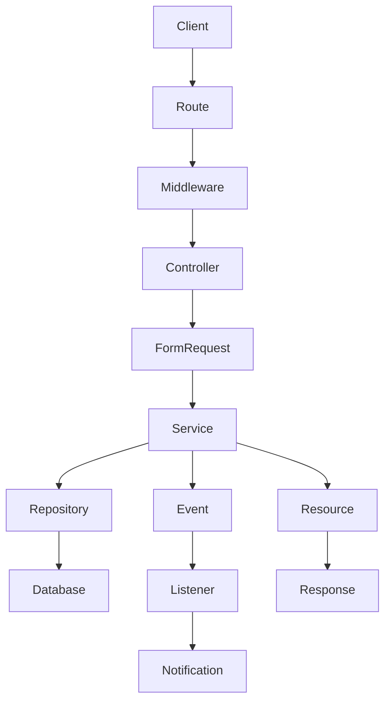
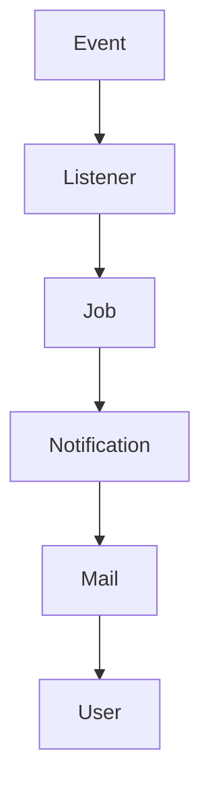

We are creating a permanent markdown document for our project.

The output is NOT an API documentation.

The output is NOT a prompt.

The output is NOT a tutorial.

The output is an EXECUTION MANUAL that every AI Agent must read before working on this Laravel project.

==================================================
SELF-APPLICATION RULE
==================================================

This manual may be too large to read in a single pass.

Before executing ANY task, the AI MUST apply the same investigation strategy described in this manual to this manual itself.

The AI MUST NOT assume it has read the complete manual until every section has been inspected.

Required process:

1. Determine whether this manual is too large to read safely.

2. If the manual is large, divide it into logical sections or chunks.

3. Read every section sequentially.

4. Keep track of which sections have already been read.

5. Continue until the entire manual has been inspected.

6. Only after the complete manual has been read may the AI begin investigating the requested feature.

The AI MUST NEVER:

- Read only the beginning of this manual.
- Skip chapters.
- Ignore appendices.
- Assume later sections contain no important information.
- Begin investigating the project before finishing this manual.

==================================================
SELF-VERIFICATION
==================================================

Before starting any investigation, the AI MUST verify:

✓ Every section of this manual has been read.

✓ Every mandatory rule has been loaded.

✓ Every checklist has been understood.

✓ Every template has been reviewed.

✓ Every workflow has been loaded.

✓ Every appendix has been inspected.

If any section of this manual has not been read,

STOP.

Continue reading this manual before doing anything else.

==================================================
RECURSIVE APPLICATION
==================================================

Every rule defined in this manual also applies to this manual itself.

If this manual defines a rule about:

- Chunking
- Reading
- Investigation
- Validation
- Evidence Collection
- Completeness

the AI MUST first apply that rule while reading this manual.

The manual is self-applicable.

==================================================
NO PARTIAL LOADING
==================================================

Partial understanding of this manual is forbidden.

The AI MUST NOT execute any project task until the entire manual has been loaded and understood.

Reading 20%, 50%, or 90% of the manual is NOT sufficient.

Only 100% completion is considered valid.

==================================================
MANUAL LOADING COMPLETION CHECKLIST
==================================================

Before proceeding, verify:

- [ ] Entire manual read.
- [ ] No unread sections remain.
- [ ] No skipped chunks.
- [ ] All mandatory rules loaded.
- [ ] All templates reviewed.
- [ ] All examples reviewed.
- [ ] All workflows reviewed.
- [ ] Self-application completed.

If any answer is NO,

the AI MUST continue reading the manual before performing any other action.

look for AGENT.md in the same folder and read it first AND save the rule with the AI and with any future AI Agents.

The filename is:

ai/api-investigation-manual.md

==================================================
LARGE FILE HANDLING
==================================================

Some project files may be too large to inspect in a single read.

The AI MUST NOT skip any part of a large file.

Instead, it MUST inspect the file incrementally until the entire file has been reviewed.

Required process:

1. Determine whether the file is too large to read safely in a single pass.

2. If the file is large, split it into logical chunks.

3. Read every chunk sequentially.

4. Keep an internal investigation log of what has already been inspected.

5. Do not reread previously inspected sections unless necessary.

6. Continue reading until the entire file has been inspected.

7. Only after the complete file has been reviewed may the AI conclude its investigation.

The AI MUST NEVER:

- Skip unread sections.
- Assume the remaining content is irrelevant.
- Stop because enough information has been found.
- Generate documentation before the entire file has been inspected.

==================================================
CHUNKING STRATEGY
==================================================

When possible, split files using logical boundaries instead of arbitrary sizes.

Preferred order:

- Namespace
- Imports
- Traits
- Constants
- Properties
- Constructor
- Public Methods
- Protected Methods
- Private Methods
- Helper Methods
- End of File

If logical boundaries are not possible, split by line ranges.

Example

Chunk 1
Lines 1–300

Chunk 2
Lines 301–600

Chunk 3
Lines 601–900

Continue until EOF.

==================================================
INVESTIGATION STATE
==================================================

The AI MUST maintain an investigation state.

Example

Current File:
ProductService.php

Progress:

✓ Lines 1–300

✓ Lines 301–600

✓ Lines 601–900

Remaining:

Lines 901–1184

The investigation is NOT complete until every section has been reviewed.

==================================================
CROSS-REFERENCE DURING CHUNKING
==================================================

If a method inside one chunk calls another method located in a later chunk,

the AI MUST postpone the conclusion and continue reading until the called method has also been inspected.

No business rule may be documented before all related methods have been reviewed.
Search is only a navigation tool.

Search results MUST NEVER replace full file inspection.

After locating a symbol using search, the AI MUST inspect the surrounding implementation and continue reviewing the entire relevant file or logical section before drawing conclusions.
==================================================
FINAL VALIDATION
==================================================

Before leaving a file, verify:

- Every line has been inspected.
- Every public method has been reviewed.
- Every called method has been traced.
- Every dependency has been inspected.
- No unread chunk remains.

If any chunk remains unread,

the AI MUST continue reading before proceeding to the next file.


==================================================
OBJECTIVE
==================================================

The purpose of this document is to force every AI Agent to investigate an endpoint exactly like a Senior Laravel Architect, Senior Backend Engineer, Product Owner, Scrum Master, QA Lead and Technical Writer combined.

The document must make it almost impossible for the AI to miss anything.

The document should work for:

- ChatGPT
- Cursor
- Claude
- Copilot
- Any future AI Agent

==================================================
PROJECT CONTEXT
==================================================

The project is Laravel.

The AI will usually receive a Route or an Endpoint.

Example

Route::get('/attributes')

or

GET /api/v1/products

The AI must know exactly how to investigate the feature before writing any documentation.

==================================================
MANDATORY REQUIREMENT
==================================================

Before doing anything,

the AI MUST read

agent.md

Only after reading agent.md may it continue reading this manual.

==================================================
GOAL OF THE MANUAL
==================================================

The manual must force the AI to:

• Understand the feature completely.

• Reverse engineer the feature.

• Trace every execution path.

• Inspect every dependency.

• Discover production bugs.

• Review tests.

• Understand business logic.

• Understand technical architecture.

• Generate production-grade documentation.

==================================================
THE MANUAL MUST COVER
==================================================

The manual must explain in extreme detail how to investigate:

Routes

Middleware

Controllers

Form Requests

Validation

Authorization

Policies

Services

Repositories

Traits

Helpers

Models

Relationships

Global Scopes

Local Scopes

Accessors

Mutators

Resources

Observers

Events

Listeners

Notifications

Jobs

Database Transactions

Locks

Cache

Redis

Queues

Broadcasting

Storage

Third-party APIs

Configuration

Feature Flags

Environment Variables

Tests

Factories

Seeders

Performance

Security

Race Conditions

N+1 Queries

Pagination

Filtering

Sorting

Searching

Business Rules

Side Effects

Response Formatting

Error Handling

Logging

Monitoring

Metrics

Analytics

Everything related to the endpoint.

==================================================
FOR EVERY LAYER
==================================================

The manual must explain:

What should be inspected.

Why it should be inspected.

How to inspect it.

What information should be extracted.

Common mistakes.

When to stop.

When to continue.

How to validate findings.

==================================================
BUG DISCOVERY
==================================================

The manual must explain how to discover production bugs.

It must force the AI to inspect:

Missing validation

Missing authorization

Dead code

Unused code

Security issues

Performance issues

Race conditions

Missing transactions

Missing eager loading

Missing indexes

Incorrect resources

Incorrect responses

Business logic bugs

Regression risks

Integration risks

The AI must stop documentation if a production bug is discovered and produce a bug report first.

==================================================
DOCUMENTATION GENERATION
==================================================

After investigation succeeds,

the AI must generate:

frontend.md

backend.md

jira.md

qa.md

changelog.md

==================================================
frontend.md MUST CONTAIN
==================================================

Business Purpose

Business Rules

Endpoint

HTTP Method

Authentication

Permissions

Headers

Request Body

Query Parameters

URL Parameters

Validation

Response Fields

Error Responses

Business Flow

API Journey

Screen Journey

Sequence Diagram

Mermaid Diagrams

When to call the endpoint

What endpoint comes before

What endpoint comes after

Frontend Notes

Caching

Pagination

Searching

Sorting

Filtering

Loading States

Empty States

Retry Strategy

Offline Behaviour

Example Requests

Example Responses
==================================================
JIRA DOCUMENTATION (FRONTEND-ORIENTED)
==================================================

The generated jira.md must be written for Frontend developers only.

Do NOT describe backend implementation details.

Do NOT mention repositories, services, listeners, events, models, migrations, or internal architecture unless they directly affect frontend behavior.

Each Jira task must focus on what the Frontend team needs to implement.

For every endpoint include:

- Feature Summary
- User Story
- Business Goal
- API Endpoint
- HTTP Method
- Authentication
- Permissions
- Exact Request URL examples
- Headers
- Request Body
- Query Parameters
- Path Parameters
- Success Response
- Validation Errors
- Authorization Errors
- Loading State
- Empty State
- Error State
- UI Behavior
- Expected UX
- Acceptance Criteria
- QA Checklist
- API Integration Notes

==================================================
USER STORY
==================================================

Write every task as a Frontend story.

Example:

As a customer,
I want to view my contact messages
so that I can review previous conversations.

==================================================
IMPLEMENTATION CHECKLIST
==================================================

Provide a checklist such as:

- Call GET /api/v1/contacts?page=1
- Display loading spinner
- Display empty state if no records exist
- Display validation messages
- Handle HTTP 401
- Handle HTTP 403
- Handle HTTP 404
- Handle HTTP 422
- Handle HTTP 500
- Refresh UI after successful action

==================================================
UI STATES
==================================================

Document all UI states.

For every endpoint specify:

- Initial Loading
- Skeleton Loader (if applicable)
- Success
- Empty
- Validation Error
- Unauthorized
- Forbidden
- Network Error
- Retry Behavior

==================================================
ACCEPTANCE CRITERIA
==================================================

Write acceptance criteria from the Frontend perspective.

Example:

✔ User can submit the form.

✔ Validation errors appear under the correct fields.

✔ Submit button is disabled while loading.

✔ Success toast appears.

✔ List refreshes automatically.

✔ Pagination updates correctly.

==================================================
DO NOT INCLUDE
==================================================

Do NOT include:

- Repository names
- Service names
- Listener names
- Event names
- Observer names
- Internal backend flow
- Database schema
- SQL
- Migrations
- Model implementation

That information belongs only in backend.md.

The jira.md file must be readable by a Frontend developer without backend knowledge.
Example Errors
==================================================
DOCUMENTATION REQUIREMENTS
==================================================

After the implementation is complete, generate the following documents:

- backend.md
- frontend.md
- qa.md
- jira.md
- changelog.md

==================================================
BACKEND DOCUMENTATION
==================================================

For every endpoint include:

- HTTP Method
- Full URL
- Authentication requirements
- Permissions
- Request validation
- Request body
- Query parameters
- Response (Success)
- Response (Validation Error)
- Response (Authorization Error)
- Database tables affected
- Events dispatched
- Notifications sent
- Jobs dispatched
- Business rules
- Error cases

Also include an execution flow diagram using Mermaid.

Example:



Every endpoint must have its own flow diagram.

==================================================
FRONTEND DOCUMENTATION
==================================================

For every endpoint document:

- Endpoint
- HTTP Method
- Authentication
- Required Headers
- Request Body
- Query Parameters
- Success Response
- Error Responses
- Loading states
- Empty states
- Permission requirements
- Notes

If the endpoint accepts URL query parameters, ALWAYS document the complete URL exactly as it should be called.

Examples:

GET /api/v1/contacts?page=1

GET /api/v1/contacts?limit=20

GET /api/v1/contacts?status=unread&page=2

GET /api/v1/products?category=5&search=phone&sort=price_desc

If multiple parameters can be combined, provide complete example URLs.

Do NOT describe them only in a table.
Show the exact URL that Frontend should call.

If path parameters exist, document them as well.

Example:

GET /api/v1/contacts/{id}

Example:

GET /api/v1/contacts/15

==================================================
QA DOCUMENTATION
==================================================

For every endpoint include:

- Positive test cases
- Validation test cases
- Authorization test cases
- Edge cases
- Regression cases

==================================================
JIRA DOCUMENTATION
==================================================

Generate:

- Summary
- Background
- Scope
- Technical Notes
- Acceptance Criteria
- Test Cases
- Risks

==================================================
CHANGELOG
==================================================

Include:

- Added
- Changed
- Fixed
- Database Changes
- API Changes
- Breaking Changes (if any)

==================================================
IMPORTANT
==================================================

The frontend document must be sufficient for a frontend developer to implement the feature without reading backend code.

The backend document must be sufficient for another backend developer to maintain the feature.

The Mermaid flow must represent the actual execution flow from the source code only.

Do not invent any flow or endpoint.
==================================================
DOCUMENTATION REQUIREMENTS
==================================================

After the implementation is complete, generate the following documents:

- backend.md
- frontend.md
- qa.md
- jira.md
- changelog.md

==================================================
BACKEND DOCUMENTATION
==================================================

For every endpoint include:

- HTTP Method
- Full URL
- Authentication requirements
- Permissions
- Request validation
- Request body
- Query parameters
- Response (Success)
- Response (Validation Error)
- Response (Authorization Error)
- Database tables affected
- Events dispatched
- Notifications sent
- Jobs dispatched
- Business rules
- Error cases

Also include an execution flow diagram using Mermaid.

Example:


Every endpoint must have its own flow diagram.

==================================================
FRONTEND DOCUMENTATION
==================================================

For every endpoint document:

- Endpoint
- HTTP Method
- Authentication
- Required Headers
- Request Body
- Query Parameters
- Success Response
- Error Responses
- Loading states
- Empty states
- Permission requirements
- Notes

If the endpoint accepts URL query parameters, ALWAYS document the complete URL exactly as it should be called.

Examples:

GET /api/v1/contacts?page=1

GET /api/v1/contacts?limit=20

GET /api/v1/contacts?status=unread&page=2

GET /api/v1/products?category=5&search=phone&sort=price_desc

If multiple parameters can be combined, provide complete example URLs.

Do NOT describe them only in a table.
Show the exact URL that Frontend should call.

If path parameters exist, document them as well.

Example:

GET /api/v1/contacts/{id}

Example:

GET /api/v1/contacts/15

==================================================
QA DOCUMENTATION
==================================================

For every endpoint include:

- Positive test cases
- Validation test cases
- Authorization test cases
- Edge cases
- Regression cases

==================================================
JIRA DOCUMENTATION
==================================================

Generate:

- Summary
- Background
- Scope
- Technical Notes
- Acceptance Criteria
- Test Cases
- Risks

==================================================
CHANGELOG
==================================================

Include:

- Added
- Changed
- Fixed
- Database Changes
- API Changes
- Breaking Changes (if any)

==================================================
IMPORTANT
==================================================

The frontend document must be sufficient for a frontend developer to implement the feature without reading backend code.

The backend document must be sufficient for another backend developer to maintain the feature.

The Mermaid flow must represent the actual execution flow from the source code only.

Do not invent any flow or endpoint.
==================================================
ENDPOINT FLOW DIAGRAM
==================================================

For EVERY endpoint, generate an execution flow diagram based ONLY on the actual source code.

Do NOT guess.

Do NOT simplify.

Do NOT invent layers.

Trace the exact execution path.

Include every layer that is actually executed.

Possible nodes include:

Client

↓

Route

↓

Middleware

↓

Policy / Permission

↓

Controller

↓

FormRequest

↓

DTO

↓

Service

↓

Repository

↓

Database

↓

Transaction

↓

Observer

↓

Event

↓

Listener

↓

Job

↓

Notification

↓

Mail

↓

Broadcast

↓

Resource

↓

JSON Response

Represent the flow using Mermaid.

Example:

```mermaid
flowchart TD

A[Client]

--> B[Route]

--> C[auth:sanctum]

--> D[email.verified]

--> E[permission:view_contacts]

--> F[ContactController@index]

--> G[ContactListRequest]

--> H[ContactRepository]

--> I[(contacts)]

--> J[ContactResource]

--> K[JSON Response]
```

If an endpoint dispatches events, continue the flow.

Example:

```mermaid
flowchart TD

A[CheckoutController@store]

--> B[CheckoutService]

--> C[OrderRepository]

--> D[(orders)]

--> E[OrderCreated Event]

E --> F[SendOrderNotification]

E --> G[StoreNotifyLogs]

F --> H[Database Notification]

G --> I[(notify_logs)]

H --> J[Response]
```

If jobs are dispatched:



==================================================
RULES
==================================================

Generate ONE Mermaid flow diagram for EVERY endpoint.

The diagram must reflect the REAL execution path found in the source code.

Do NOT merge multiple endpoints into one diagram.

If different execution paths exist (success vs failure), draw separate branches.

Include:

- Validation failures
- Authorization failures
- Transactions
- Rollbacks
- Events
- Listeners
- Notifications
- Jobs
- Resources
- Response generation

The diagram must be detailed enough that another backend developer can understand the complete lifecycle of the endpoint without reading the source code.

==================================================
backend.md MUST CONTAIN
==================================================

Complete execution flow.

Every method called.

Every service.

Every repository.

Every model.

Every observer.

Every event.

Every listener.

Every notification.

Every queued job.

Every transaction.

Every lock.

Every cache interaction.

Every external API.

Every response resource.

Every side effect.

Every dependency.

Business logic explanation.

Architecture explanation.

Extension points.

Files to modify for future changes.

Potential risks.

==================================================
jira.md MUST CONTAIN
==================================================

Business Value

Problem Statement

User Story

Acceptance Criteria

Business Rules

Dependencies

Technical Notes

Frontend Tasks

Backend Tasks

QA Tasks

Risks

Definition of Done

Story Points suggestion

==================================================
qa.md MUST CONTAIN
==================================================

Positive Cases

Negative Cases

Validation Cases

Authorization Cases

Edge Cases

Regression Cases

Performance Cases

Security Cases

Test Data

Expected Results

==================================================
changelog.md MUST CONTAIN
==================================================

Changes

Reasons

Affected Files

Migration Notes

Regression Impact

Deployment Notes

Rollback Notes

==================================================
THE MANUAL MUST INCLUDE
==================================================

Large reusable templates.

Large real Laravel examples.

Real production examples.

Mermaid examples.

Folder structure examples.

Decision trees.

Investigation checklists.

Quality gates.

Completion checklists.

==================================================
WRITING STYLE
==================================================

This is NOT a tutorial.

This is NOT an article.

This is NOT a blog post.

This is an Engineering Execution Manual.

Write using imperative language.

Every sentence should tell the AI exactly what to do.

Avoid theory.

Avoid filler.

Avoid motivational text.

Avoid repeating information.

==================================================
QUALITY
==================================================

Every checklist should be exhaustive.

Every template should be reusable.

Every example should be realistic.

Every rule should be actionable.
# Additional Investigation Requirements

The following requirements are mandatory for every investigated feature.

These sections exist to eliminate hidden business logic, reduce communication between teams, and make the generated documentation the single source of truth.

---

# Feature Boundary Discovery

Before documenting the requested endpoint, determine whether it belongs to a larger business feature.

Never assume the feature consists of a single endpoint.

Identify every endpoint that participates in the same business workflow.

Document:

- Entry Point
- Supporting Endpoints
- Exit Points
- Background Processes
- Scheduled Jobs
- Webhooks
- Admin Endpoints
- Mobile Endpoints

Example

Customer Checkout

GET /cart

↓

POST /coupon/apply

↓

GET /shipping-methods

↓

POST /checkout

↓

GET /transactions/{uuid}

↓

POST /payment/webhook

↓

GET /orders/{id}

The generated documentation must explain the complete feature, not only the requested endpoint.

---

# Business Journey

Describe the complete business journey from the user's perspective.

The journey should explain why the endpoint exists.

Example

Customer enters application

↓

Searches for products

↓

Views product details

↓

Adds item to cart

↓

Applies coupon

↓

Chooses shipping address

↓

Selects payment method

↓

Creates order

↓

Completes payment

↓

Receives confirmation

Every endpoint must be positioned within this journey.

---

# Screen Mapping

Identify every screen that consumes the endpoint.

Document

- Screen Name
- User Type
- Trigger Action
- Navigation Source
- Navigation Destination

Example

Product Details Screen

↓

User presses Add To Cart

↓

POST /cart

↓

Cart Badge Refreshes

---

# API Journey

Document the complete API sequence.

Example

POST /login

↓

GET /profile

↓

GET /categories

↓

GET /products

↓

POST /cart

↓

POST /coupon/apply

↓

POST /checkout

↓

GET /orders

This section allows frontend developers to know what comes before and after the endpoint.

---

# Dependency Mapping

Identify every dependency.

Document

Depends On

Used By

Shared Services

Shared Models

Shared Resources

Shared Events

Shared Observers

Shared Policies

Shared Traits

Shared Helpers

Example

Checkout

Depends On

Cart

Inventory

Coupon

Promotion

Address

Payment

Shipping

Currency

Tax

---

# Database Impact

Document every affected table.

Separate them into

Reads

Creates

Updates

Deletes

Example

Reads

products

inventory

addresses

Creates

orders

transactions

Updates

inventory

coupons

Deletes

cart_items

---

# State Transition Mapping

Document every state transition caused by the endpoint.

Example

Cart

ACTIVE

↓

CHECKED_OUT

↓

COMPLETED

Another Example

Order

PENDING

↓

PAID

↓

PROCESSING

↓

SHIPPED

↓

DELIVERED

State changes must always be documented.

---

# Permission Matrix

Document exactly who may access the endpoint.

Example

| Role | Access |
|-------|--------|
| Guest | No |
| Customer | Yes |
| Vendor | No |
| Cashier | Yes |
| Admin | Yes |

Never describe permissions vaguely.

---

# Hidden Side Effects

Identify every indirect action.

Examples

Dispatch Event

Create Notification

Update Inventory

Create Transaction

Update Search Index

Invalidate Cache

Broadcast Event

Send Email

Queue Job

Generate Invoice

Upload File

Every side effect must be documented.

---

# Breaking Change Analysis

Determine what will break if this endpoint changes.

Document

Affected Endpoints

Affected Screens

Affected Services

Affected Jobs

Affected Scheduled Tasks

Affected Mobile Screens

Affected Admin Pages

Affected Integrations

Affected Third-party Systems

---

# Modification Guide

Explain where future modifications belong.

Examples

Change Validation

↓

StoreProductRequest

Change Authorization

↓

Policy

Change Business Logic

↓

OrderService

Change Response

↓

OrderResource

Change Search

↓

ProductFilter

Change Pricing

↓

ProductPricingService

Change Notifications

↓

OrderObserver

The goal is to allow future developers to modify the correct layer immediately.

---

# Sequence Diagram Requirement

Generate at least one Mermaid Sequence Diagram whenever the endpoint interacts with multiple components.

Example

Frontend

↓

API

↓

Controller

↓

Service

↓

Repository

↓

Database

↓

Resource

↓

Frontend

---

# Extension Points

Identify safe extension points.

Examples

Add Loyalty Program

↓

RewardService

Add Tax Calculation

↓

TaxService

Add Audit Logging

↓

OrderObserver

Add Search Indexing

↓

Search Listener

This section helps future developers extend the feature safely.

---

# Risks

Identify

Technical Risks

Business Risks

Security Risks

Performance Risks

Maintenance Risks

Future Scalability Risks

Document mitigation strategies whenever possible.

---

# Documentation Confidence

At the end of every generated document provide

Documentation Confidence

Example

98%

Reason

Complete source code inspected.

Feature tests available.

Missing

Payment webhook tests.

Inventory stress tests.

Never report 100% confidence unless every execution path has been verified.

---

# Known Gaps

Document every discovered gap.

Examples

Missing Feature Tests

Missing Authorization

Missing Rate Limiter

Missing Transaction

Missing Lock

Missing Cache

Missing Observer

Missing Policy

Missing Validation

Missing Error Handling

---

# AI Self Audit

Before finishing the documentation verify

- [ ] Every middleware inspected.
- [ ] Every controller inspected.
- [ ] Every service inspected.
- [ ] Every repository inspected.
- [ ] Every helper inspected.
- [ ] Every trait inspected.
- [ ] Every model inspected.
- [ ] Every relationship inspected.
- [ ] Every resource inspected.
- [ ] Every observer inspected.
- [ ] Every event inspected.
- [ ] Every listener inspected.
- [ ] Every notification inspected.
- [ ] Every queued job inspected.
- [ ] Every external API inspected.
- [ ] Every cache interaction inspected.
- [ ] Every database transaction inspected.
- [ ] Every test reviewed.
- [ ] Every business rule documented.
- [ ] Every side effect documented.
- [ ] Every risk documented.
- [ ] Every dependency documented.

Documentation MUST NOT be generated until every applicable item above has been completed.

# Source Evidence

Every important statement MUST include its source.

Document

- File
- Class
- Method
- Line Number (when available)

Example

Business Rule

Expired coupons cannot be applied.

Evidence

packages/marvel/src/Services/CouponValidator.php

Method

validateCoupon()

Never document any behavior without evidence.

If evidence cannot be found

Write

NOT VERIFIED
# Change Impact Analysis

For every endpoint determine the impact of future modifications.

Document

Affected APIs

Affected Screens

Affected Mobile Screens

Affected Admin Pages

Affected Scheduled Jobs

Affected Queue Workers

Affected Events

Affected Notifications

Affected Reports

Affected Dashboards

Affected Third-party Integrations

Estimate

Low

Medium

High

Critical
# Feature Entry Points

Identify every possible entry point into the feature.

Possible entry points include

HTTP Endpoint

Webhook

Queue Job

Scheduled Command

Artisan Command

Admin Action

Observer

Listener

Notification

Broadcast Event

Every entry point must be documented.
# Feature Exit Points

Determine how the feature ends.

Possible exit points

JSON Response

Redirect

Queue Dispatch

Notification

Webhook

Broadcast

Database Commit

Cache Update

External API

Every exit point must be documented.
# Failure Matrix

Document every possible failure.

Validation Failure

Authorization Failure

Business Rule Failure

Database Failure

Deadlock

Timeout

Third-party Failure

Rate Limit

Storage Failure

Queue Failure

Payment Failure

For each failure document

Cause

HTTP Code

Returned Message

Recovery Strategy
# Business Rule Matrix

Extract every business rule.

For every rule document

Rule Name

Purpose

Where Implemented

Dependencies

Risk

Example

Rule

Only active products may be purchased.

Implemented In

OrderService

Risk

High
# Validation Matrix

For every request document

Field

Validation Rules

Default Value

Nullable

Conditional Rules

Custom Rules

Error Messages

Transformation

# Authorization Matrix

Document

Authentication

Authorization

Policy

Permission

Role

Guard

Middleware

Every authorization layer must be documented.
# Event Timeline

Document execution order.

Controller

↓

Service

↓

Event

↓

Listener

↓

Queue

↓

Notification

↓

Database

↓

Response

The exact order must be verified.
# Configuration Dependencies

Identify

.env Variables

config/*.php

Feature Flags

Constants

Cache Keys

Redis Keys

Storage Disks

Queues

Drivers

# Environment Requirements

Document

Redis Required

Queue Required

Storage Required

Broadcast Driver

Mail Driver

Search Engine

Payment Gateway

Scheduler

Supervisor

# Data Flow

Track data movement.

Request

↓

Validation

↓

DTO

↓

Service

↓

Repository

↓

Database

↓

Resource

↓

JSON

Every transformation must be documented.
# Data Ownership

Identify

Who owns this data?

Customer

Admin

Vendor

Cashier

System

Third-party
# Cross Feature Dependencies

Determine which features depend on this feature.

Cart

Inventory

Coupon

Promotion

Order

Shipping

Payments

Analytics

Notifications

Search

Reviews
# Regression Risk Matrix

If modified

What could break?

Frontend

Mobile

Checkout

Payments

Reports

Analytics

Exports

Queues

Search

Admin

# Version Compatibility

Document

Current Version

Deprecated

Breaking Changes

Migration Notes

Backward Compatibility
# Performance Budget

Expected Queries

Expected Memory

Expected Response Time

Expected Cache Usage

Expected Queue Usage

Expected External Calls

Document violations.
# Security Checklist

Authentication

Authorization

Mass Assignment

IDOR

SQL Injection

XSS

CSRF

Rate Limiting

Sensitive Data

Hidden Fields

Transactions

Locks

Audit Logs
# Observability

Document

Logs

Metrics

Tracing

Monitoring

Alerts

Audit Logs

Error Tracking
# Documentation Score

Business Logic

10/10

Architecture

10/10

Frontend

10/10

Backend

10/10

QA

10/10

Security

10/10

Performance

10/10

Examples

10/10

Diagrams

10/10

Overall

98%

The final document should become the single source of truth that every AI Agent reads before starting any endpoint investigation or documentation work.
