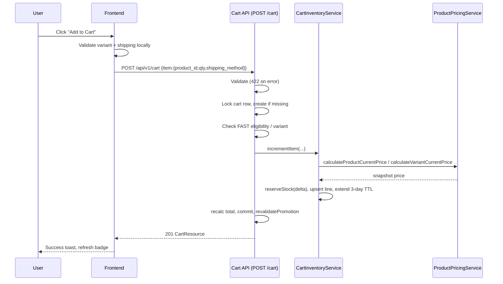
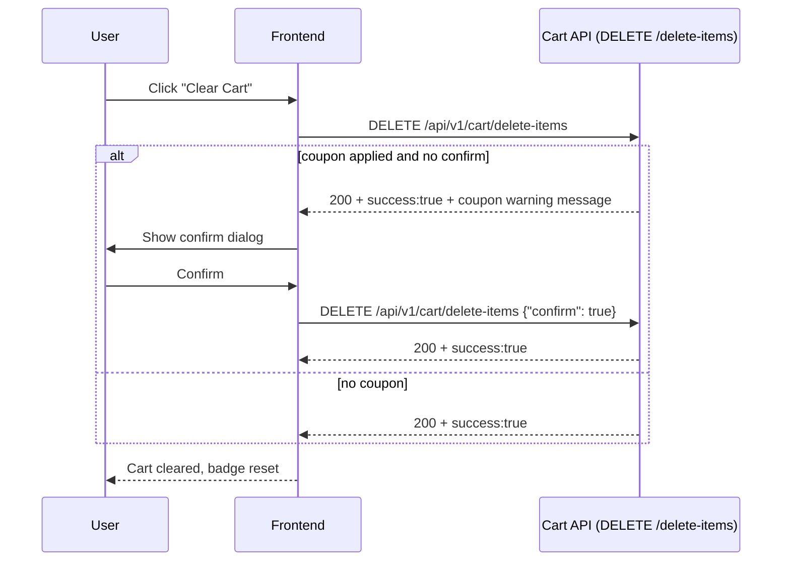
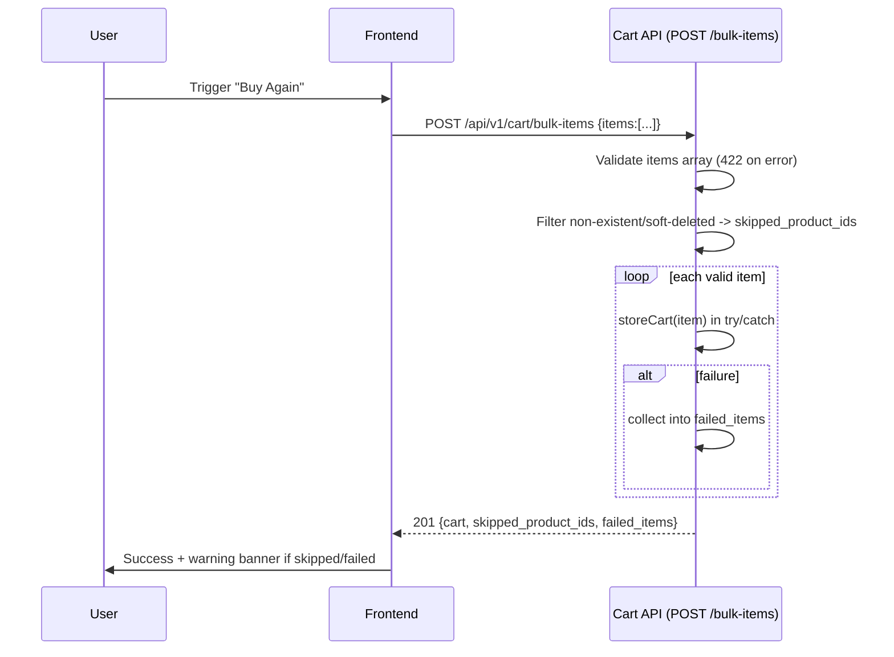

# Cart Module — Frontend Integration Guide

> Source of truth: `packages/marvel/src/Rest/Routes.php` (lines 149-157), `CartController.php`, `CartResource.php`, `CartItemResource.php`, `CouponResource.php`. Documented against actual source on 2026-08-04 (Revision 4).

---

## Overview

The Cart API lets an authenticated customer manage a single shopping cart with inventory reservation. Every customer has **at most one cart row** (`carts.user_id` is UNIQUE), so the list endpoint effectively returns one cart. Items are split into two delivery groups — **SCHEDULED** (`normal_items`) and **FAST** (`fast_items`) — each rendered as a separate section.

---

## Business Purpose

- Add products (simple or variant) to a persistent cart.
- Adjust quantities incrementally (`operation: increment|decrement`).
- Reserve inventory for 3 days (TTL) so reserved stock is not sold to others.
- Split items by delivery method for segmented delivery (normal + express).
- Apply a coupon and display discount breakdown.
- Show promotion eligibility and gift items (free, price = 0).
- Bulk-add items (e.g., "Buy Again" / wishlist-to-cart) with per-item failure reporting.

---

## Business Rules

| # | Rule |
|---|------|
| 1 | One cart per user — the API reuses the existing cart row on every add/update. |
| 2 | Price is **snapshotted** at add time; it does NOT change if the product price changes later. |
| 3 | Adding reserves inventory for 3 days (`expires_at = now + 3 days`); cart expires if untouched. |
| 4 | FAST shipping requires `product.is_fast_shipping_available === true` (else 400). |
| 5 | Variable products MUST send `product_variant_id` (else 400 `INVALID_ITEM_DATA`). |
| 6 | Same product + variant + shipping method in one add **accumulates** quantity. |
| 7 | Clearing a cart with a coupon requires `confirm: true` — the API returns **HTTP 200 with `success: true`** and a warning message otherwise. |
| 8 | Coupon is cleared automatically when the last item is removed. |
| 9 | Promotion discounts are cleared/revalidated on every mutation. |
| 10 | Rate limit: 20 requests per minute per user (`throttle:cart`). |

---

## Endpoints

| # | Method | URL | Auth | Purpose |
|---|--------|-----|------|---------|
| 1 | GET | `/api/v1/cart` | Bearer token | List user cart (paginated) |
| 2 | POST | `/api/v1/cart` | Bearer token | Add item |
| 3 | GET | `/api/v1/cart/{id}` | Bearer token | Show one cart |
| 4 | POST | `/api/v1/cart/bulk-items` | Bearer token | Bulk add items |
| 5 | PUT | `/api/v1/cart/update-item` | Bearer token | Update item quantity (increment/decrement) |
| 6 | DELETE | `/api/v1/cart/delete-item/{itemId}` | Bearer token | Remove one item |
| 7 | DELETE | `/api/v1/cart/delete-items` | Bearer token | Clear entire cart |

**Base URL:** `/api/v1`
**Headers:** `Authorization: Bearer {token}` · `Accept: application/json` · `Content-Type: application/json` (for body payloads)

---

## 1. GET /api/v1/cart — List Cart

**Purpose:** Load the customer's cart on cart-page mount or after any mutation.

**Query Parameters**

| Parameter | Type | Default | Description |
|-----------|------|---------|-------------|
| page | int | 1 | Page number |
| limit | int | 15 | Items per page (controller reads `limit`, **not** `per_page`) |

> ⚠️ The endpoint reads `limit`. Sending `per_page` has no effect.

**Response 200 — response shape**

```json
{
  "status": 200,
  "message": "Data fetched successfully",
  "success": true,
  "data": {
    "data": [
      {
        "id": 1,
        "user_id": 3,
        "coupon": {
          "id": 5,
          "name": "Save 10%",
          "slug": "save-10",
          "code": "SAVE10",
          "image": { "desktop": null, "mobile": null },
          "borderColor": null,
          "borderless": false
        },
        "coupon_code": "SAVE10",
        "status": "active",
        "reserved_at": "2026-07-28T10:00:00.000000Z",
        "expires_at": "2026-07-31T10:00:00.000000Z",
        "total_items": 3,
        "total_quantity": 5,
        "subtotal": 1499.97,
        "total_price": 1499.97,
        "coupon_discount": 149.99,
        "total_after_coupon": 1349.98,
        "normal_items_count": 2,
        "fast_items_count": 1,
        "normal_items": [
          {
            "id": 1,
            "product_id": 10,
            "product_variant_id": null,
            "quantity": 2,
            "price": 499.99,
            "total_price": 999.98,
            "attributes": null,
            "shipping_method": "SCHEDULED",
            "promotion_id": null,
            "discount_amount": 0,
            "is_gift": false,
            "product": {
              "id": 10,
              "name": "Wireless Headphones",
              "slug": "wireless-headphones",
              "thumbnail": "https://cdn.example.com/products/thumbnail.jpg"
            }
          }
        ],
        "fast_items": [],
        "has_eligible_promotion": false
      }
    ],
    "page": 1,
    "current_page": 1,
    "from": 1,
    "to": 1,
    "last_page": 1,
    "path": "http://localhost:8000/api/v1/cart",
    "per_page": 15,
    "total": 1,
    "next_page_url": null,
    "prev_page_url": null,
    "last_page_url": "http://localhost:8000/api/v1/cart?page=1",
    "first_page_url": "http://localhost:8000/api/v1/cart?page=1"
  }
}
```

**Response Fields**

| Field | Type | Notes |
|-------|------|-------|
| `data.data` | array | Cart array — length 0 or 1 (unique user cart) |
| `data.data[].id` | int | Cart ID |
| `data.data[].user_id` | int | Owner |
| `data.data[].coupon` | object\|null | `{ id, name, slug, code, image{desktop,mobile}, borderColor, borderless }` |
| `data.data[].coupon_code` | string\|null | Coupon code string |
| `data.data[].status` | string | `active` \| `checked_out` \| `expired` |
| `data.data[].reserved_at` | datetime\|null | Last reservation timestamp |
| `data.data[].expires_at` | datetime\|null | Reservation expiry (3-day TTL) |
| `data.data[].total_items` | int\|null | Distinct line count |
| `data.data[].total_quantity` | int\|null | Sum of quantities |
| `data.data[].subtotal` / `total_price` | float | Sum of item total_prices (rounded 2 dp) |
| `data.data[].coupon_discount` | float | Computed by `CouponCalculator` at serialization |
| `data.data[].total_after_coupon` | float | `max(0, subtotal - coupon_discount)` |
| `data.data[].normal_items_count` / `fast_items_count` | int | Group sizes |
| `data.data[].normal_items` / `fast_items` | array | `CartItemResource[]` (see below) |
| `data.data[].has_eligible_promotion` | bool | Promotion eligibility flag |
| `data.data.*` (pagination) | mixed | `page`, `current_page`, `from`, `to`, `last_page`, `path`, `per_page`, `total`, `next_page_url`, `prev_page_url`, `last_page_url`, `first_page_url` |

**CartItem fields:** `id`, `product_id`, `product_variant_id`, `quantity`, `price`, `total_price`, `attributes`, `shipping_method`, `promotion_id`, `discount_amount`, `is_gift`, `product` → `{ id, name, slug, thumbnail } | null`.

**Errors**

| Status | Meaning | Note |
|--------|---------|------|
| 401 | Missing/invalid token | Redirect to login |
| 429 | Rate limit (20/min) | Retry after backoff |

---

## 2. POST /api/v1/cart — Add Item

**Purpose:** Add one product to the cart.

**Request Body**

```json
{
  "item": {
    "product_id": 10,
    "quantity": 2,
    "shipping_method": "SCHEDULED"
  }
}
```

| Field | Type | Required | Description |
|-------|------|----------|-------------|
| `item` | object | required | Item container |
| `item.product_id` | int | required | Valid product ID |
| `item.quantity` | int | required | min 1 |
| `item.product_variant_id` | int | sometimes | Required for variable products |
| `item.attributes` | array | sometimes | Custom attributes |
| `item.shipping_method` | string | required | `SCHEDULED` or `FAST` |

**Validation rules** — `item: required|array|min:1`; `item.product_id: required|integer|exists:products,id`; `item.quantity: required|integer|min:1`; `item.product_variant_id: sometimes|nullable|integer|exists:product_variants,id`; `item.attributes: sometimes|array`; `item.shipping_method: required|string|in:SCHEDULED,FAST,scheduled,fast`.

**Response 201** — `CartResource` (same shape as the cart object above).

**Errors**

| Status | Meaning |
|--------|---------|
| 400 | Business error — e.g., stock exceeded, FAST not eligible, missing variant for variable product |
| 422 | Validation — raw field-error object (`{ "item.quantity": ["..."] }`) |
| 401 | Unauthenticated |
| 429 | Rate limit |

**Business Flow**

1. Validate → 422 on failure.
2. Repository opens a transaction, locks the cart row, creates cart if absent, sets status active.
3. Validates product/variant/FAST eligibility.
4. `CartInventoryService` locks inventory, delta-reserves stock, **snapshots price**, creates/updates the line, extends the 3-day TTL.
5. Recalculates cart total, commits.
6. `revalidatePromotion()` clears stale promotion/discount fields.
7. Returns 201 with full cart.

---

## 3. GET /api/v1/cart/{id} — Show Cart

**Purpose:** Fetch one specific cart by ID (used for deep-linking or debugging).

**URL Parameter**

| Field | Type | Description |
|-------|------|-------------|
| `id` | int | Cart ID (numeric only — route uses `->whereNumber('id')`) |

**Response 200** — `CartResource` (single object under `data`).

**Errors**

| Status | Meaning |
|--------|---------|
| 403 | Cart belongs to another user |
| 404 | Cart not found |
| 401 / 429 | Auth / rate limit |

---

## 4. PUT /api/v1/cart/update-item — Update Quantity

**Purpose:** Change an existing item's quantity. The `operation` field selects the behavior — **increment** (existing + qty) or **decrement** (existing − qty).

> ⚠️ `operation` is **required** — requests without it get 422.

**Request Body**

```json
{
  "item": {
    "product_id": 10,
    "quantity": 3,
    "operation": "increment"
  }
}
```

| Field | Type | Required | Description |
|-------|------|----------|-------------|
| `item.product_id` | int | required | Product ID to update |
| `item.quantity` | int | required | Quantity delta (min 1) |
| `item.product_variant_id` | int | sometimes | Variant ID for variable products |
| `item.attributes` | array | sometimes | Attributes |
| `item.shipping_method` | string | sometimes | If omitted, existing item's method is preserved |
| `item.operation` | string | required | `increment` or `decrement` |

**Validation rules** — same as create plus `item.operation: required|string|in:increment,decrement`; `item.product_id: required_with:item`; `item.quantity: required_with:item`.

**Response 200** — `CartResource`.

**Behavior**
- `increment` → desired = existing + quantity; reserve extra stock.
- `decrement` → desired = existing − quantity; if the result would be < 1 the item is **deleted** and its reserved stock released; if it was the last item the coupon is cleared.
- If `operation` is `decrement` and the item does not exist → 400.
- If `increment` exceeds available stock → 400.

**Errors**

| Status | Meaning |
|--------|---------|
| 400 | Business error (stock, item not found, eligibility) |
| 422 | Validation (missing `operation`, invalid operation, quantity 0) |
| 401 / 429 | Auth / rate limit |

---

## 5. DELETE /api/v1/cart/delete-item/{itemId} — Remove Item

**Purpose:** Remove a single line item.

**URL Parameter**

| Field | Type | Description |
|-------|------|-------------|
| `itemId` | int | Cart item ID |

**Response 200**

```json
{ "status": 200, "message": "Cart item deleted successfully", "success": true }
```

**Behavior** — releases reserved stock, deletes the line, clears coupon if last, recalculates total, revalidates promotion.

**Errors**

| Status | Meaning |
|--------|---------|
| 400 | No cart / ownership mismatch / item not found / release failure — all return `DELETE_CART_ITEM_FAILED` |
| 401 / 429 | Auth / rate limit |

---

## 6. DELETE /api/v1/cart/delete-items — Clear Cart

**Purpose:** Remove all items and release all reserved inventory.

**Request Body (optional)**

| Field | Type | Required | Description |
|-------|------|----------|-------------|
| `confirm` | boolean | when coupon applied | `true` to confirm deletion while a coupon is applied |

**Response 200 (cleared)**

```json
{ "status": 200, "message": "Cart deleted successfully", "success": true }
```

**Response 200 (warning — coupon applied without `confirm`)** ⚠️

```json
{
  "status": 200,
  "message": "This cart has a coupon applied. Please confirm to proceed with deletion.",
  "success": true
}
```

> ⚠️ **Important:** the coupon-warning is returned with **HTTP 200 and `success: true`**. The frontend MUST detect it by message content (or presence of the coupon) and re-send with `{"confirm": true}` after user confirmation. Do NOT rely on the HTTP status code.

**Errors**

| Status | Meaning |
|--------|---------|
| 404 | No cart exists (`CART_NOT_FOUND`) |
| 400 | Ownership mismatch |
| 401 / 429 | Auth / rate limit |

**Business Flow** — `releaseCart($cart, true)` releases all reserved stock, deletes all items, resets `total_price = 0`, clears `expires_at`/`reserved_at`, keeps cart row with `status = active`.

---

## 7. POST /api/v1/cart/bulk-items — Bulk Add

**Purpose:** Add several products in one request (e.g., wishlist-to-cart, "Buy Again"). **Non-atomic** — each item is processed independently.

**Request Body**

```json
{
  "items": [
    { "product_id": 10, "quantity": 2, "shipping_method": "SCHEDULED" },
    { "product_id": 15, "product_variant_id": 3, "quantity": 1, "shipping_method": "FAST" }
  ]
}
```

| Field | Type | Required | Description |
|-------|------|----------|-------------|
| `items` | array | required | Array of item objects |
| `items.*.product_id` | int | required | Product ID |
| `items.*.quantity` | int | required | min 1 |
| `items.*.product_variant_id` | int | sometimes | Variant ID |
| `items.*.shipping_method` | string | sometimes | Defaults to `SCHEDULED` when omitted |

**Response 201**

```json
{
  "status": 201,
  "message": "Cart created successfully",
  "success": true,
  "data": {
    "cart": { "...": "full CartResource object" },
    "skipped_product_ids": [99, 100],
    "failed_items": [
      { "product_id": 15, "product_variant_id": 3, "reason": "Quantity exceeds available stock." }
    ]
  }
}
```

| Field | Description |
|-------|-------------|
| `data.cart` | Full cart (`CartResource`) — **null when every item failed** |
| `data.skipped_product_ids` | IDs of non-existent or soft-deleted products, silently skipped |
| `data.failed_items` | `[{ product_id, product_variant_id, reason }]` for runtime failures |

**Errors**

| Status | Meaning |
|--------|---------|
| 422 | `items` not an array / missing product_id / quantity 0 |
| 401 / 429 | Auth / rate limit |

**Business Flow**

1. Merges JSON body into the request (handles both form-encoded and raw JSON).
2. Validates `items` inline → 422 on structural errors.
3. Normalizes `shipping_method` to uppercase (default `SCHEDULED`).
4. Pre-filters non-existent/soft-deleted products → `skipped_product_ids`.
5. For each valid item, calls `storeCart()` individually in a try/catch — failures collected in `failed_items`, processing continues.
6. Returns 201 with cart + skip/failure reports.

---

## When To Call Each Endpoint

| Screen | Endpoint(s) | Trigger |
|--------|-------------|---------|
| Header badge / mini-cart | `GET /cart` | On app load, after any cart mutation, on navigation |
| Product detail / listing | `POST /cart` | Click "Add to Cart" |
| Product detail (variable) | `POST /cart` | Click "Add to Cart" after variant selection |
| Cart page | `GET /cart` | Mount / pull-to-refresh / after mutations |
| Cart page | `PUT /update-item` | Quantity +/- (debounced) |
| Cart page | `DELETE /delete-item/{itemId}` | Item remove button + confirm |
| Cart page | `DELETE /delete-items` | "Clear Cart" + confirm (with coupon → double confirm) |
| Wishlist / Buy Again | `POST /bulk-items` | Bulk add action |
| Coupon | `POST /api/v1/coupons/add-to-cart` | "Apply" coupon (outside cart module) |

**Before/After Endpoint Calls**
- Before `POST /cart` → ensure variant selected (variable products) and shipping method chosen.
- After any mutation → refresh with `GET /cart` (or apply optimistic update with the returned `CartResource`).
- After `DELETE /delete-items` → clear local coupon state and refresh.

---

## Sequence Diagrams

### Add to Cart



### Clear Cart with Coupon



### Bulk Add



---

## Screen Journey

```
Login/App Shell
   │  GET /cart (badge count)
   ▼
Product Listing / Product Detail
   │  POST /cart (add) → toast + badge++
   ▼
Cart Page
   │  GET /cart
   │  ├── Standard Delivery section (normal_items)
   │  ├── Express Delivery section (fast_items)
   │  ├── Gift item section (is_gift, "FREE")
   │  ├── Coupon input + discount breakdown
   │  └── Summary: subtotal, coupon_discount, total_after_coupon
   │  PUT /update-item (debounced quantity +/-)
   │  DELETE /delete-item/{itemId} (confirm)
   │  DELETE /delete-items (confirm; coupon → double confirm)
   ▼
Checkout (next module)
   │  uses cart totals + expires_at countdown
```

---

## Frontend Notes

1. **Response nesting** — The list endpoint returns cart(s) at `data.data[0]` (paginated envelope). The store/show/update endpoints return the cart object directly under `data`. Normalize once in an API layer helper.
2. **Coupon object** — `coupon` is a nested object (`CouponResource`): use `name`, `code`, `image.desktop`, `image.mobile`, `borderColor`, `borderless` for display. It is `null` when no coupon resolves.
3. **Warning detection** — For clear-cart, detect the coupon-warning by checking the response `message` (or by knowing a coupon is applied) instead of the HTTP status (always 200).
4. **Price snapshotting** — Do not re-fetch live product prices for cart lines; display `price` / `total_price` as returned.
5. **TTL countdown** — `expires_at` is the reservation deadline. Show a countdown; on expiry the cart becomes `expired` and items vanish.
6. **Gift items** — `is_gift: true` → price 0, display "FREE", do not allow quantity edit.
7. **Debounce updates** — quantity +/- should be debounced (~300ms) to stay under the 20 req/min limit.
8. **Float precision** — all money is already rounded to 2 dp by the API; format for display.

### Caching
- Cache the cart response in memory/store (e.g., React Query / Zustand) with a short staleTime (30-60s) for the header badge.
- Invalidate the cart cache key on every successful cart mutation.

### Pagination
- The list endpoint is paginated, but only one cart exists per user. Frontends can ignore pagination; if used, read the `limit` param (not `per_page`).

### Search / Sort / Filter
- The cart endpoints do **not** support server-side search, sort, or filtering. Grouping is done server-side by shipping method (`normal_items` / `fast_items`).

---

## UI States

| State | Behavior |
|-------|----------|
| **Loading** | Skeleton placeholders for cart rows (3-4); disable add/update buttons with spinners |
| **Empty** | "Your cart is empty" illustration + "Start Shopping" CTA (empty `normal_items`/`fast_items`) |
| **Success** | Toast with `message`; update badge and totals from returned cart |
| **Error 400** | Toast the `message` (e.g., stock exceeded, FAST not eligible); revert optimistic quantity |
| **Error 422** | Field-level errors under each input |
| **Error 401** | Redirect to login with return URL |
| **Error 403** | Security error — should not occur; log + redirect |
| **Error 404** | "Cart not found" (rare) — reset local cart state |
| **Error 429** | "Too many requests, please wait" + disable cart controls briefly |
| **Network/offline** | Toast "Network error, please try again"; keep last known cart state; retry button |
| **Retry** | Pull-to-refresh or explicit "Retry" re-issues `GET /cart` |
| **Expired** | Banner "Your cart reservation has expired" — items may no longer be available |

---

## Example Requests

```bash
# List cart
curl -X GET "http://localhost:8000/api/v1/cart?limit=15" \
  -H "Authorization: Bearer {token}" -H "Accept: application/json"

# Add item
curl -X POST "http://localhost:8000/api/v1/cart" \
  -H "Authorization: Bearer {token}" -H "Content-Type: application/json" \
  -d '{"item":{"product_id":10,"quantity":2,"shipping_method":"SCHEDULED"}}'

# Increment quantity
curl -X PUT "http://localhost:8000/api/v1/cart/update-item" \
  -H "Authorization: Bearer {token}" -H "Content-Type: application/json" \
  -d '{"item":{"product_id":10,"quantity":1,"operation":"increment"}}'

# Remove item
curl -X DELETE "http://localhost:8000/api/v1/cart/delete-item/1" \
  -H "Authorization: Bearer {token}"

# Clear cart with coupon confirmation
curl -X DELETE "http://localhost:8000/api/v1/cart/delete-items" \
  -H "Authorization: Bearer {token}" -H "Content-Type: application/json" \
  -d '{"confirm":true}'

# Bulk add
curl -X POST "http://localhost:8000/api/v1/cart/bulk-items" \
  -H "Authorization: Bearer {token}" -H "Content-Type: application/json" \
  -d '{"items":[{"product_id":10,"quantity":2,"shipping_method":"SCHEDULED"},{"product_id":15,"quantity":1}]}'
```
