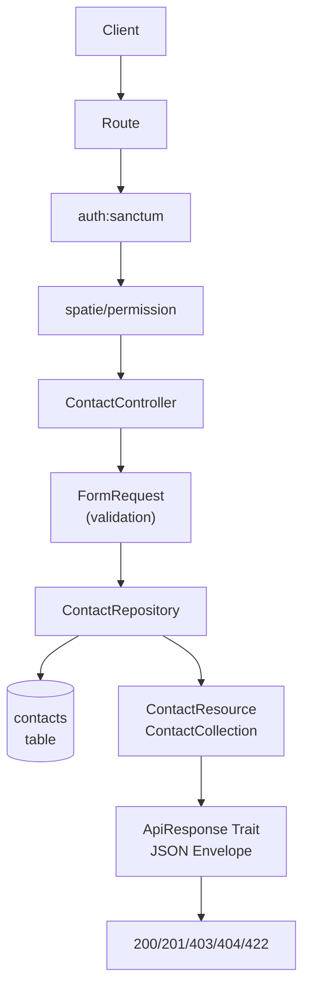
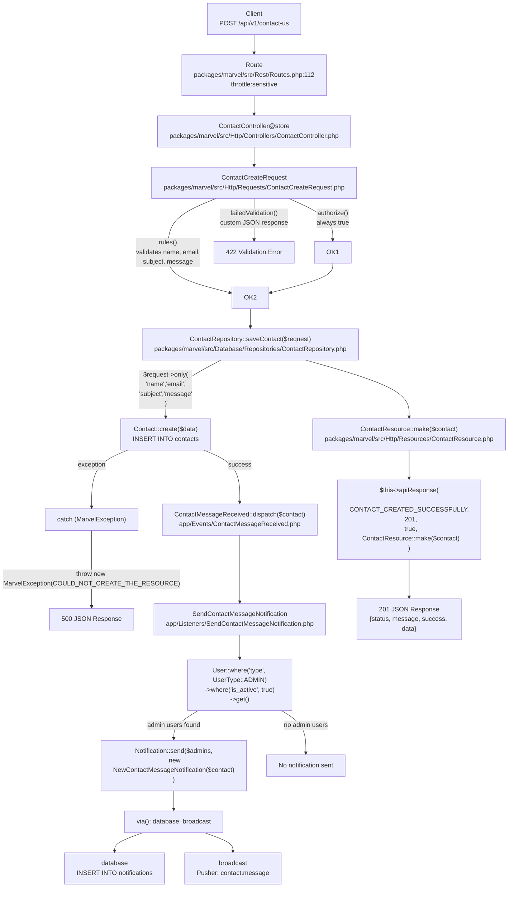
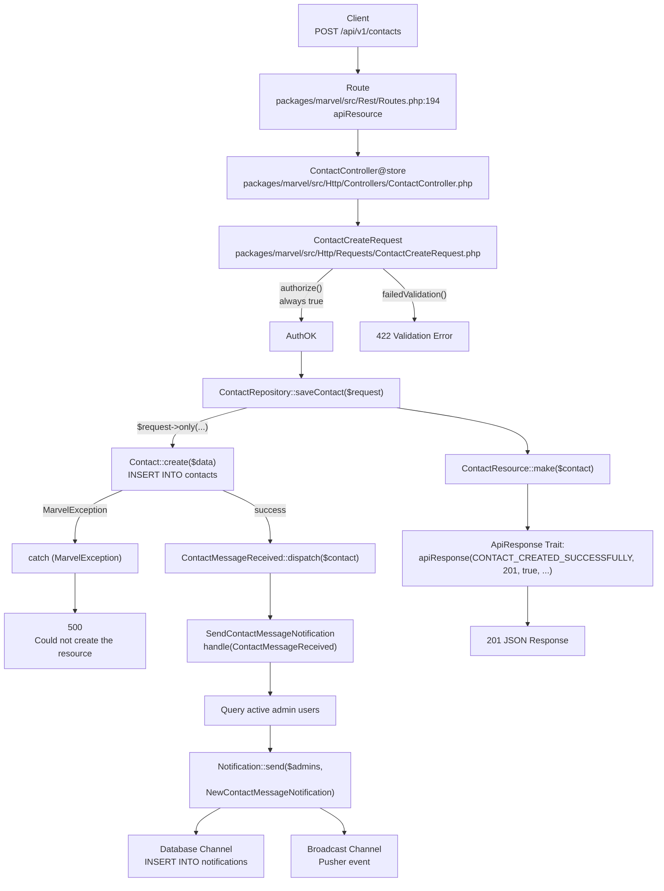
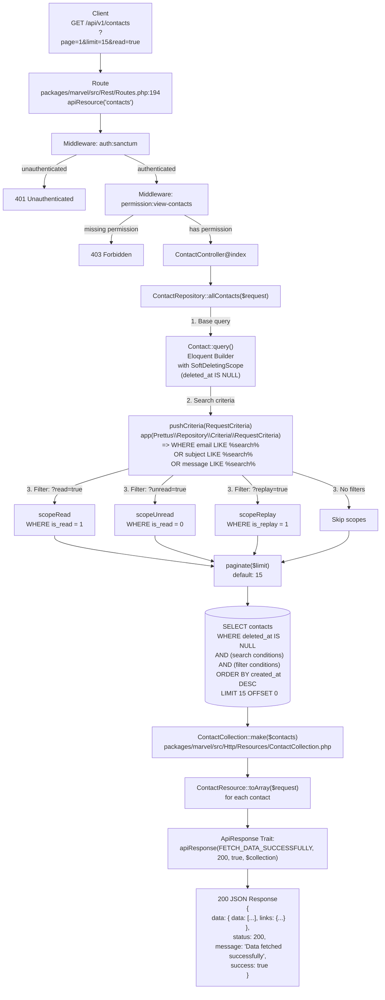
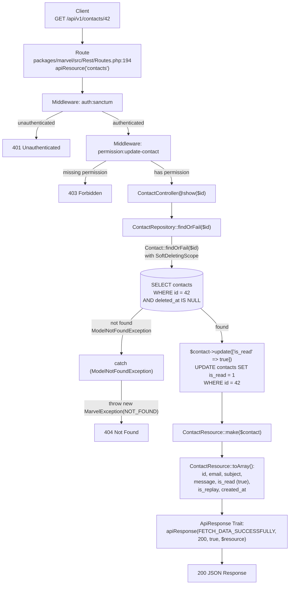
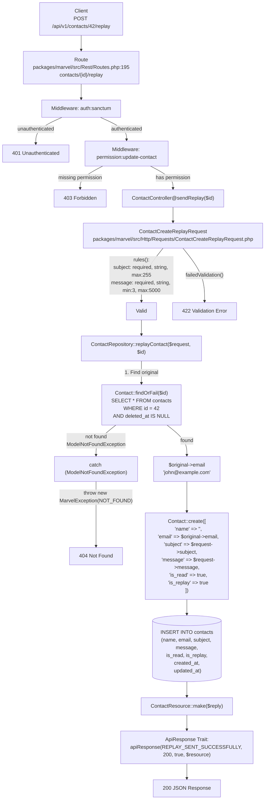
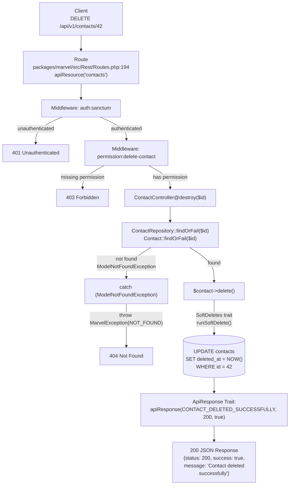
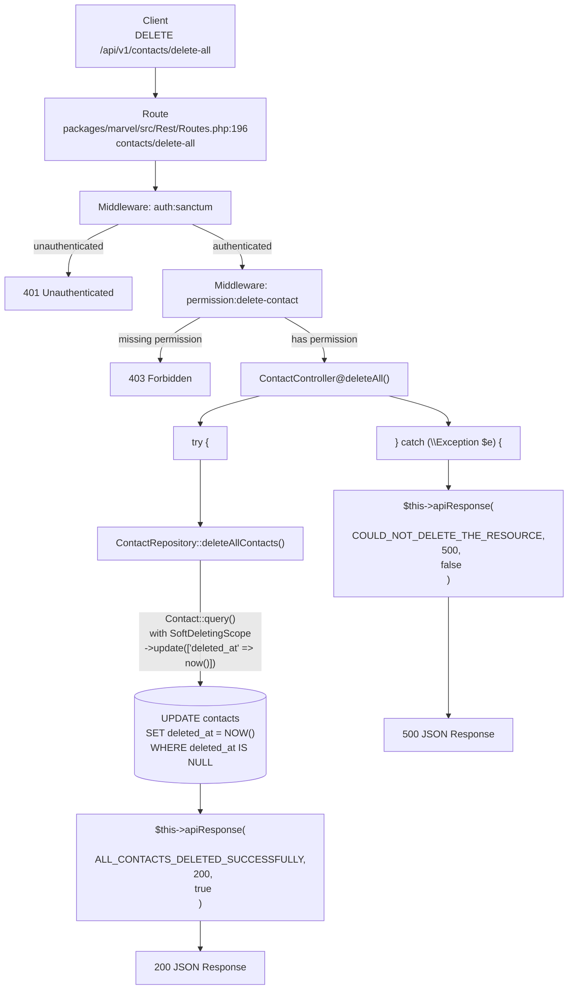
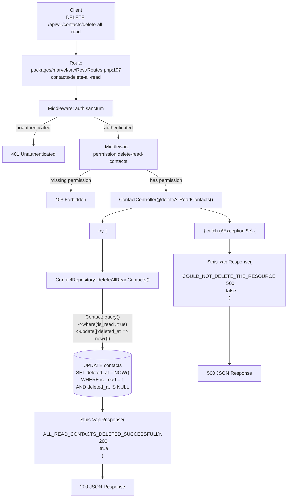

# Contacts — Backend Documentation

## Overview

The Contacts module handles user-submitted inquiries and admin replies. It supports public submission, admin listing with filters, read/unread tracking, replies, and bulk delete operations.

---

## Overall Architecture



---

## Endpoints

---

### POST /api/v1/contact-us — Submit Contact (Rate-Limited)

**HTTP Method:** `POST`

**Full URL:** `POST /api/v1/contact-us`

**Authentication:** None

**Permissions:** None

**Rate Limit:** 5 requests/minute per IP (throttle:sensitive)

**Request Body:**
```json
{
  "name": "John Doe",
  "email": "john@example.com",
  "subject": "Product Inquiry",
  "message": "I have a question about product #123."
}
```

**Validation Rules:**

| Field | Rules |
|-------|-------|
| `name` | required, string, max:255 |
| `email` | required, email, max:255 |
| `subject` | required, string, max:255 |
| `message` | required, string, min:3, max:5000 |

**Success Response (201):**
```json
{
  "status": 201,
  "message": "Contact created successfully",
  "success": true,
  "data": {
    "id": 1,
    "email": "john@example.com",
    "subject": "Product Inquiry",
    "message": "I have a question about product #123.",
    "is_read": false,
    "is_replay": false,
    "created_at": "2026-06-20T12:00:00.000000Z"
  }
}
```

**Validation Error (422):**
```json
{
  "message": "The given data was invalid.",
  "errors": {
    "email": ["The email field is required."],
    "subject": ["The subject field is required."],
    "message": ["The message field is required."]
  }
}
```

**Rate Limit Error (429):**
```json
{
  "message": "Too Many Attempts."
}
```

**Server Error (500):**
```json
{
  "status": 500,
  "message": "Could not create the resource",
  "success": false
}
```

**Database Tables Affected:** `contacts` — INSERT

**Events Dispatched:** `ContactMessageReceived`

**Notifications Sent:** `NewContactMessageNotification` (database + broadcast) to all active admin users

**Jobs Dispatched:** None

**Business Rules:**
- Public endpoint, no authentication
- Rate limited to 5 requests/minute/IP
- `is_read` and `is_replay` default to false
- Dispatches `ContactMessageReceived` which triggers admin notification

**Error Cases:**
- 422: Validation failure
- 429: Rate limit exceeded
- 500: Database error or resource creation failure

**Flow Diagram:**



---

### POST /api/v1/contacts — Submit Contact

**HTTP Method:** `POST`

**Full URL:** `POST /api/v1/contacts`

**Authentication:** None

**Permissions:** None

**Request Body:**
```json
{
  "name": "John Doe",
  "email": "john@example.com",
  "subject": "Product Inquiry",
  "message": "I have a question about product #123."
}
```

**Validation Rules:**

| Field | Rules |
|-------|-------|
| `name` | required, string, max:255 |
| `email` | required, email, max:255 |
| `subject` | required, string, max:255 |
| `message` | required, string, min:3, max:5000 |

**Success Response (201):** Same as `/api/v1/contact-us`

**Validation Error (422):** Same as `/api/v1/contact-us`

**Server Error (500):** Same as `/api/v1/contact-us`

**Database Tables Affected:** `contacts` — INSERT

**Events Dispatched:** `ContactMessageReceived`

**Notifications Sent:** `NewContactMessageNotification` (database + broadcast) to all active admin users

**Jobs Dispatched:** None

**Business Rules:**
- Public endpoint, no authentication
- No rate limit (unlike `/api/v1/contact-us`)
- Identical behavior to `/api/v1/contact-us` otherwise

**Error Cases:**
- 422: Validation failure
- 500: Database error

**Flow Diagram:**



---

### GET /api/v1/contacts — List Contacts

**HTTP Method:** `GET`

**Full URL:** `GET /api/v1/contacts`

**Query Parameters:** `page`, `limit`, `read`, `unread`, `replay`, `search`

**Authentication:** Required (Bearer token)

**Permissions:** `view-contacts`

**Query Parameters:**

| Parameter | Type | Default | Description |
|-----------|------|---------|-------------|
| `page` | int | 1 | Page number |
| `limit` | int | 15 | Results per page |
| `read` | bool | — | Filter `is_read = true` |
| `unread` | bool | — | Filter `is_read = false` |
| `replay` | bool | — | Filter `is_replay = true` |
| `search` | string | — | Search email, subject, message (LIKE) |

**Success Response (200):**
```json
{
  "status": 200,
  "message": "Data fetched successfully",
  "success": true,
  "data": {
    "data": [
      {
        "id": 1,
        "email": "john@example.com",
        "subject": "Product Inquiry",
        "message": "I have a question about product #123.",
        "is_read": false,
        "is_replay": false,
        "created_at": "2026-06-20T12:00:00.000000Z"
      }
    ],
    "links": {
      "current_page": 1,
      "from": 1,
      "to": 15,
      "last_page": 1,
      "per_page": 15,
      "total": 1,
      "path": "http://example.com/api/v1/contacts",
      "first_page_url": "http://example.com/api/v1/contacts?page=1",
      "last_page_url": "http://example.com/api/v1/contacts?page=1",
      "next_page_url": null,
      "prev_page_url": null
    }
  }
}
```

**Unauthenticated (401):**
```json
{
  "message": "Unauthenticated."
}
```

**Authorization Error (403):**
```json
{
  "status": 403,
  "message": "You are not authorized to perform this action",
  "success": false
}
```

**Database Tables Affected:** `contacts` — SELECT (with SoftDeletes scope)

**Events Dispatched:** None

**Notifications Sent:** None

**Jobs Dispatched:** None

**Business Rules:**
- Requires authentication and `view-contacts` permission
- Soft-deleted contacts excluded
- `read` and `unread` mutually exclusive
- Paginated with configurable `limit` (default 15)
- Searchable fields: email, subject, message

**Error Cases:**
- 401: No authentication token
- 403: Missing `view-contacts` permission

**Flow Diagram:**



---

### GET /api/v1/contacts/{id} — Show Contact

**HTTP Method:** `GET`

**Full URL:** `GET /api/v1/contacts/{id}`

**Authentication:** Required (Bearer token)

**Permissions:** `update-contact`

**Path Parameters:**

| Parameter | Type | Description |
|-----------|------|-------------|
| `id` | int | Contact ID |

**Success Response (200):**
```json
{
  "status": 200,
  "message": "Data fetched successfully",
  "success": true,
  "data": {
    "id": 1,
    "email": "john@example.com",
    "subject": "Product Inquiry",
    "message": "I have a question about product #123.",
    "is_read": true,
    "is_replay": false,
    "created_at": "2026-06-20T12:00:00.000000Z"
  }
}
```

**Not Found (404):**
```json
{
  "status": 404,
  "message": "Not found",
  "success": false
}
```

**Database Tables Affected:**
- `contacts` — SELECT (find contact)
- `contacts` — UPDATE (set `is_read = true`)

**Events Dispatched:** None

**Notifications Sent:** None

**Jobs Dispatched:** None

**Business Rules:**
- Requires authentication and `update-contact` permission
- Automatically marks contact as read (`is_read = true`)
- Returns 404 if contact does not exist or is soft-deleted

**Error Cases:**
- 401: No authentication token
- 403: Missing `update-contact` permission
- 404: Contact not found or soft-deleted

**Flow Diagram:**



---

### POST /api/v1/contacts/{id}/replay — Send Reply

**HTTP Method:** `POST`

**Full URL:** `POST /api/v1/contacts/42/replay`

**Authentication:** Required (Bearer token)

**Permissions:** `update-contact`

**Path Parameters:**

| Parameter | Type | Description |
|-----------|------|-------------|
| `id` | int | Original contact ID |

**Request Body:**
```json
{
  "subject": "RE: Product Inquiry",
  "message": "Thank you for your inquiry. Product #123 is in stock."
}
```

**Validation Rules:**

| Field | Rules |
|-------|-------|
| `subject` | required, string, max:255 |
| `message` | required, string, min:3, max:5000 |

**Success Response (200):**
```json
{
  "status": 200,
  "message": "Replay sent successfully",
  "success": true,
  "data": {
    "id": 2,
    "email": "john@example.com",
    "subject": "RE: Product Inquiry",
    "message": "Thank you for your inquiry. Product #123 is in stock.",
    "is_read": true,
    "is_replay": true,
    "created_at": "2026-06-20T12:30:00.000000Z"
  }
}
```

**Not Found (404):**
```json
{
  "status": 404,
  "message": "Not found",
  "success": false
}
```

**Validation Error (422):**
```json
{
  "message": "The given data was invalid.",
  "errors": {
    "subject": ["The subject field is required."],
    "message": ["The message field is required."]
  }
}
```

**Database Tables Affected:**
- `contacts` — SELECT (find original)
- `contacts` — INSERT (create reply)

**Events Dispatched:** None (reply does NOT fire ContactMessageReceived)

**Notifications Sent:** None

**Jobs Dispatched:** None

**Business Rules:**
- Requires authentication and `update-contact` permission
- Uses original contact's email for the new reply record
- Creates a NEW contact record (original is NOT modified)
- New record has `is_read = true`, `is_replay = true`
- Original record remains unchanged (no mark as read, no mark as replayed)

**Error Cases:**
- 401: No authentication token
- 403: Missing `update-contact` permission
- 404: Original contact not found or soft-deleted
- 422: Validation failure

**Flow Diagram:**



---

### DELETE /api/v1/contacts/{id} — Delete Contact

**HTTP Method:** `DELETE`

**Full URL:** `DELETE /api/v1/contacts/42`

**Authentication:** Required (Bearer token)

**Permissions:** `delete-contact`

**Path Parameters:**

| Parameter | Type | Description |
|-----------|------|-------------|
| `id` | int | Contact ID |

**Success Response (200):**
```json
{
  "status": 200,
  "message": "Contact deleted successfully",
  "success": true
}
```

**Not Found (404):**
```json
{
  "status": 404,
  "message": "Not found",
  "success": false
}
```

**Database Tables Affected:** `contacts` — UPDATE (set `deleted_at = now()`) — soft delete

**Events Dispatched:** None

**Notifications Sent:** None

**Jobs Dispatched:** None

**Business Rules:**
- Requires authentication and `delete-contact` permission
- Soft delete — record remains in database but excluded from queries
- Returns 404 if contact not found or already soft-deleted

**Error Cases:**
- 401: No authentication token
- 403: Missing `delete-contact` permission
- 404: Contact not found

**Flow Diagram:**



---

### DELETE /api/v1/contacts/delete-all — Delete All Contacts

**HTTP Method:** `DELETE`

**Full URL:** `DELETE /api/v1/contacts/delete-all`

**Authentication:** Required (Bearer token)

**Permissions:** `delete-contact`

**Success Response (200):**
```json
{
  "status": 200,
  "message": "All contacts deleted successfully",
  "success": true
}
```

**Server Error (500):**
```json
{
  "status": 500,
  "message": "Could not delete the resource",
  "success": false
}
```

**Database Tables Affected:** `contacts` — UPDATE (set `deleted_at = now()` on all non-deleted rows)

**Events Dispatched:** None

**Notifications Sent:** None

**Jobs Dispatched:** None

**Business Rules:**
- Requires authentication and `delete-contact` permission
- Soft-deletes ALL contacts (mass update, not model instance delete)
- Uses `SoftDeletingScope` — only affects non-deleted records
- No per-model events fired (mass update)

**Error Cases:**
- 401: No authentication token
- 403: Missing `delete-contact` permission
- 500: Database error

**Flow Diagram:**



---

### DELETE /api/v1/contacts/delete-all-read — Delete All Read Contacts

**HTTP Method:** `DELETE`

**Full URL:** `DELETE /api/v1/contacts/delete-all-read`

**Authentication:** Required (Bearer token)

**Permissions:** `delete-read-contacts`

**Success Response (200):**
```json
{
  "status": 200,
  "message": "All read contacts deleted successfully",
  "success": true
}
```

**Server Error (500):**
```json
{
  "status": 500,
  "message": "Could not delete the resource",
  "success": false
}
```

**Database Tables Affected:** `contacts` — UPDATE (set `deleted_at = now()` on rows WHERE `is_read = true` AND `deleted_at IS NULL`)

**Events Dispatched:** None

**Notifications Sent:** None

**Jobs Dispatched:** None

**Business Rules:**
- Requires authentication and `delete-read-contacts` permission
- Soft-deletes only contacts where `is_read = true`
- Unread contacts are NOT affected
- Mass update — no per-model events fired

**Error Cases:**
- 401: No authentication token
- 403: Missing `delete-read-contacts` permission
- 500: Database error

**Flow Diagram:**



---

## Permissions Map

| Permission Enum | String Value | Applied To |
|----------------|--------------|------------|
| `VIEW_CONTACTS` | `view-contacts` | GET /api/v1/contacts |
| `UPDATE_CONTACT` | `update-contact` | GET /api/v1/contacts/{id}, POST /api/v1/contacts/{id}/replay |
| `DELETE_CONTACT` | `delete-contact` | DELETE /api/v1/contacts/{id}, DELETE /api/v1/contacts/delete-all |
| `DELETE_READ_CONTACTS` | `delete-read-contacts` | DELETE /api/v1/contacts/delete-all-read |

---

## Database Schema

### `contacts` Table

| Column | Type | Constraints | Default | Description |
|--------|------|-------------|---------|-------------|
| id | bigint | PK, AUTO_INCREMENT | | Unique identifier |
| name | varchar(255) | NOT NULL | | Sender name |
| email | varchar(255) | NOT NULL | | Sender email |
| subject | varchar(255) | NOT NULL | | Message subject |
| message | text | NOT NULL | | Message body |
| is_read | tinyint(1) | NOT NULL | 0 | Read status |
| is_replay | tinyint(1) | NOT NULL | 0 | Reply status |
| created_at | timestamp | NULLABLE | NULL | Creation time |
| updated_at | timestamp | NULLABLE | NULL | Last update |
| deleted_at | timestamp | NULLABLE | NULL | Soft delete timestamp |

---

## Event Flow

### ContactMessageReceived

| Property | Value |
|----------|-------|
| Class | `App\Events\ContactMessageReceived` |
| Dispatched by | `ContactRepository::saveContact()` after `Contact::create()` |
| Trigger | Contact creation via POST /api/v1/contacts or POST /api/v1/contact-us |
| Data | `$contact` (Contact model instance) |
| Listener | `App\Listeners\SendContactMessageNotification` |

### SendContactMessageNotification

| Property | Value |
|----------|-------|
| handle() | Queries `User::where('type', UserType::ADMIN)->where('is_active', true)->get()` |
| Sends | `NewContactMessageNotification` to all found admin users |
| Channels | `database`, `broadcast` |
| Queueable | Yes (`ShouldQueue` + `Queueable`) |

### NewContactMessageNotification

| Property | Value |
|----------|-------|
| Database payload | title, message, icon, resource_type, resource_id, action_url, contact_id, customer_name, customer_email, subject |
| Broadcast type | `contact.message` |

---

## Response Envelope

```json
{
  "status": 200,
  "message": "Localized message string",
  "success": true,
  "data": {}
}
```

Implemented via `Marvel\Traits\ApiResponse` — used by `ContactController` which extends `CoreController`.

---

## Complete File Dependency Map

| Layer | File | Responsibility |
|-------|------|----------------|
| Routes | `packages/marvel/src/Rest/Routes.php:108,193-196` | Route definitions |
| Controller | `packages/marvel/src/Http/Controllers/ContactController.php` | HTTP handling |
| CoreController | `packages/marvel/src/Http/Controllers/CoreController.php` | Base controller (pagination, limit) |
| Create Request | `packages/marvel/src/Http/Requests/ContactCreateRequest.php` | Create validation |
| Reply Request | `packages/marvel/src/Http/Requests/ContactCreateReplayRequest.php` | Reply validation |
| Repository | `packages/marvel/src/Database/Repositories/ContactRepository.php` | Data access |
| Model | `packages/marvel/src/Database/Models/Contact.php` | Eloquent model + scopes |
| Resource | `packages/marvel/src/Http/Resources/ContactResource.php` | Response transform |
| Collection | `packages/marvel/src/Http/Resources/ContactCollection.php` | Paginated transform |
| Event | `app/Events/ContactMessageReceived.php` | Event fired on create |
| Listener | `app/Listeners/SendContactMessageNotification.php` | Event handler |
| Notification | `app/Notifications/NewContactMessageNotification.php` | DB + broadcast |
| Permission Enum | `packages/marvel/src/Enums/Permission.php` | Permission constants |
| ApiResponse Trait | `packages/marvel/src/Traits/ApiResponse.php` | Response envelope |
| Migration | `packages/marvel/database/migrations/2026_05_09_000003_create_contacts_table.php` | Schema |
| EN Translations | `resources/lang/en/message.php` | English messages |
| AR Translations | `resources/lang/ar/message.php` | Arabic messages |
| Constants | `packages/marvel/config/constants.php` | Message keys |

---

## Localization Keys

All keys prefixed with `APP_NOTICE_DOMAIN` (default: `MARVEL_`). Final key example: `MARVEL_MESSAGE.CONTACT_CREATED_SUCCESSFULLY`.

| Constant | English |
|----------|---------|
| `MESSAGE.CONTACT_CREATED_SUCCESSFULLY` | Contact created successfully |
| `MESSAGE.REPLAY_SENT_SUCCESSFULLY` | Replay sent successfully |
| `MESSAGE.CONTACT_DELETED_SUCCESSFULLY` | Contact deleted successfully |
| `MESSAGE.ALL_CONTACTS_DELETED_SUCCESSFULLY` | All contacts deleted successfully |
| `MESSAGE.ALL_READ_CONTACTS_DELETED_SUCCESSFULLY` | All read contacts deleted successfully |
| `MESSAGE.FETCH_DATA_SUCCESSFULLY` | Data fetched successfully |
| `ERROR.COULD_NOT_CREATE_THE_RESOURCE` | Could not create the resource |
| `ERROR.COULD_NOT_DELETE_THE_RESOURCE` | Could not delete the resource |
