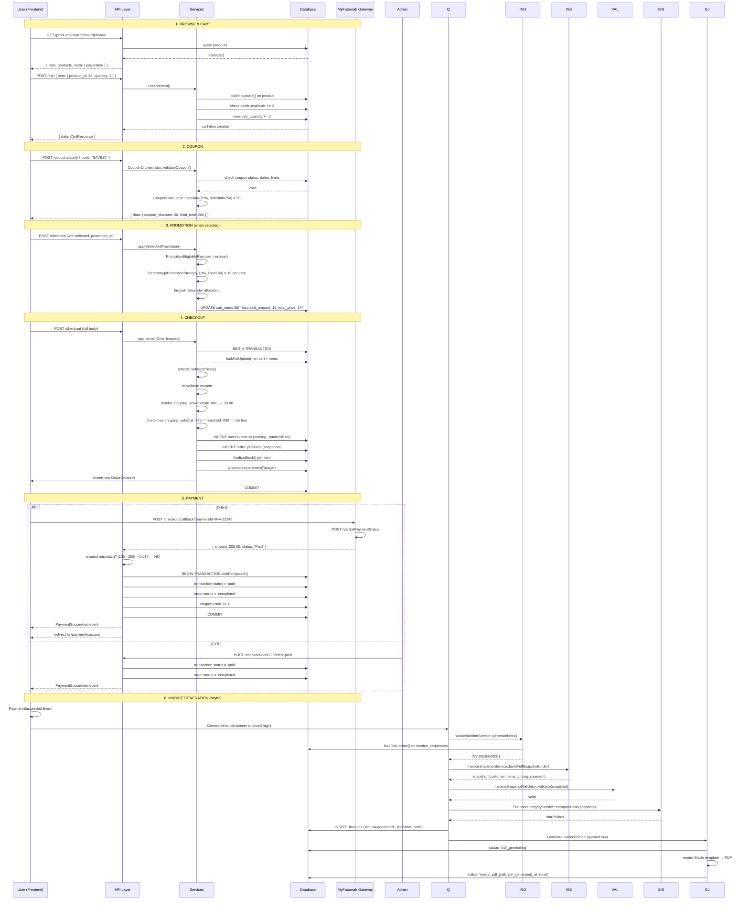

# Complete E-Commerce Flow — Step by Step

> All routes, request/response bodies, and explanations for the full checkout lifecycle.

---

## Table of Contents

1. [Browse Products](#1-browse-products)
2. [View Product Detail](#2-view-product-detail)
3. [Add to Cart](#3-add-to-cart)
4. [View Cart](#4-view-cart)
5. [Apply Coupon](#5-apply-coupon)
6. [Apply Promotion](#6-apply-promotion)
7. [Preview Invoice (Price Calculation)](#7-preview-invoice-price-calculation)
8. [Checkout (Create Order)](#8-checkout-create-order)
9. [Online Payment — Gateway Redirect](#9-online-payment--gateway-redirect)
10. [Payment Callback (Success)](#10-payment-callback-success)
11. [Invoice Generation Flow](#11-invoice-generation-flow)
12. [Invoice Status Transitions](#12-invoice-status-transitions)
13. [Invoice Regeneration (Admin)](#13-invoice-regeneration-admin)
14. [Payment Error Callback](#14-payment-error-callback)
15. [COD — Mark as Paid (Admin)](#15-cod--mark-as-paid-admin)
16. [View Order](#16-view-order)
17. [Cancel Unpaid Orders (Auto)](#17-cancel-unpaid-orders-auto)
18. [Expire Abandoned Carts (Auto)](#18-expire-abandoned-carts-auto)
19. [Full Sequence Diagram](#19-full-sequence-diagram)

---

## 1. Browse Products

**Route**: `GET /api/v1/general/products`

**Auth**: None

**Query Parameters**:

| Param | Type | Description |
|---|---|---|
| `search` | string | Full-text search |
| `category` | string | Category slug |
| `brand` | string | Brand slug |
| `min_price` | number | Minimum price |
| `max_price` | number | Maximum price |
| `sort` | string | `created_at`, `price`, `name`, `-price` (desc) |
| `page` | integer | Page number (default: 1) |
| `limit` | integer | Per page (default: 15, max: 100) |
| `range` | string | `0,100` (price range) |
| `tags` | string | Comma-separated tag slugs |
| `shipping` | string | `scheduled`, `fast` |

**Response** `200`:
```json
{
  "success": true,
  "message": "",
  "data": [
    {
      "id": 42,
      "name": "Wireless Headphones",
      "slug": "wireless-headphones",
      "price": 100.00,
      "current_price": 80.00,
      "has_variants": false,
      "quantity": 50,
      "in_stock": true,
      "discount_active": true,
      "flash_sale_active": false,
      "is_fast_shipping_available": true,
      "ratings": 4.5,
      "image": {
        "thumbnail": "https://cdn.example.com/thumb.jpg",
        "original": ["https://cdn.example.com/img1.jpg"]
      }
    }
  ],
  "meta": {
    "current_page": 1,
    "last_page": 10,
    "per_page": 15,
    "total": 150
  }
}
```

---

## 2. View Product Detail

**Route**: `GET /api/v1/general/products/{slug}`

**Auth**: None

**Response** `200`:
```json
{
  "success": true,
  "data": {
    "id": 42,
    "name": "Wireless Headphones",
    "slug": "wireless-headphones",
    "description": "High-quality wireless headphones with noise cancellation.",
    "price": 100.00,
    "current_price": 80.00,
    "discount_type": "percentage",
    "discount_amount": 20.00,
    "start_date": "2026-07-01",
    "end_date": "2026-07-31",
    "sku": "SKU-WH-001",
    "quantity": 50,
    "sold_quantity": 10,
    "in_stock": true,
    "product_type": "simple",
    "height": 10, "width": 8, "length": 5, "weight": 0.3,
    "has_flash_sale": false,
    "has_discount": true,
    "is_fast_shipping_available": true,
    "discount_active": true,
    "flash_sale_active": false,
    "categories": [
      { "id": 1, "level": 1, "name": "Electronics", "slug": "electronics" }
    ],
    "images": {
      "thumbnail": "https://cdn.example.com/thumb.jpg",
      "original": ["https://cdn.example.com/img1.jpg", "https://cdn.example.com/img2.jpg"]
    },
    "variants": [],
    "reviews": [],
    "related_products": [],
    "filters": {}
  }
}
```

**Price resolution logic** (automatic in `ProductPricingService`):
```
Flash Sale Price → (if active, overrides everything)
Sale Discount → (if has_discount & discount_active, applies to base)
Base Price → (fallback)
```

---

## 3. Add to Cart

**Route**: `POST /api/v1/cart`

**Auth**: `sanctum`

**Rate Limit**: `20/min`

**Request Body**:
```json
{
  "item": {
    "product_id": 42,
    "quantity": 2,
    "product_variant_id": null,
    "shipping_method": "SCHEDULED",
    "attributes": null
  }
}
```

**Validation Rules**:

| Field | Required | Rules |
|---|---|---|
| `item` | YES | array, min:1 |
| `item.product_id` | YES | integer, exists:products,id |
| `item.quantity` | YES | integer, min:1 |
| `item.product_variant_id` | NO | integer, exists:product_variants,id |
| `item.shipping_method` | YES | in:SCHEDULED,FAST,scheduled,fast |

**What happens**:
1. `CartInventoryService::reserveItem()` runs in a DB transaction
2. Product price is resolved via `ProductPricingService::calculateProductCurrentPrice()`
3. Product/variant row is locked with `lockForUpdate()`
4. Available stock checked: `stock_quantity - reserved_quantity >= quantity`
5. Cart item created with `price = current_price`, `total_price = price × quantity`
6. Product `reserved_quantity += quantity`
7. `in_stock` recalculated

**Response** `201`:
```json
{
  "success": true,
  "message": "CREATE_CART_SUCCESSFULLY",
  "data": {
    "id": 1,
    "user_id": 5,
    "coupon": null,
    "coupon_code": null,
    "status": "active",
    "total_items": 1,
    "total_quantity": 2,
    "total_price": 160.00,
    "subtotal": 160.00,
    "coupon_discount": 0,
    "total_after_coupon": 160.00,
    "normal_items_count": 1,
    "fast_items_count": 0,
    "normal_items": [
      {
        "id": 10,
        "product_id": 42,
        "product_variant_id": null,
        "quantity": 2,
        "price": 80.00,
        "total_price": 160.00,
        "shipping_method": "SCHEDULED",
        "promotion_id": null,
        "discount_amount": 0,
        "is_gift": false,
        "product": {
          "id": 42,
          "name": "Wireless Headphones",
          "slug": "wireless-headphones",
          "thumbnail": "https://cdn.example.com/thumb.jpg"
        }
      }
    ],
    "fast_items": [],
    "has_eligible_promotion": false
  }
}
```

**Error** `409` (insufficient stock):
```json
{
  "success": false,
  "message": "INSUFFICIENT_STOCK",
  "data": {}
}
```

---

## 4. View Cart

**Route**: `GET /api/v1/cart`

**Auth**: `sanctum`

**Rate Limit**: `20/min`

**Response** `200`:
```json
{
  "success": true,
  "data": {
    "id": 1,
    "user_id": 5,
    "coupon": { "id": 10, "code": "SAVE20" },
    "coupon_code": "SAVE20",
    "status": "active",
    "total_items": 3,
    "total_quantity": 5,
    "total_price": 250.00,
    "subtotal": 250.00,
    "coupon_discount": 50.00,
    "total_after_coupon": 200.00,
    "normal_items_count": 2,
    "fast_items_count": 1,
    "normal_items": [],
    "fast_items": [],
    "has_eligible_promotion": true
  }
}
```

**Empty cart response**:
```json
{
  "success": true,
  "message": "Cart is empty",
  "data": {
    "id": 1,
    "user_id": 5,
    "coupon": null,
    "coupon_code": null,
    "status": "active",
    "total_items": 0,
    "total_quantity": 0,
    "total_price": 0,
    "subtotal": 0,
    "coupon_discount": 0,
    "total_after_coupon": 0,
    "normal_items": [],
    "fast_items": [],
    "has_eligible_promotion": false
  }
}
```

---

## 5. Apply Coupon

**Route**: `POST /api/v1/general/coupons/apply`

**Auth**: `sanctum`

**Request Body**:
```json
{
  "code": "SAVE20"
}
```

**What happens**:
1. `CouponService::applyCoupon(request)` called
2. `CouponOrchestrator::validateCoupon()` runs:
   - `CouponValidator` checks: status = active, within dates, global limiter, per-user usage, product scope
   - `CouponAssignmentValidator` checks: assignment quotas (if assigned coupon)
3. `CouponCalculator::calculate(coupon, subtotal)` computes discount:
   - `percentage`: `subtotal × discount/100`, capped at `max_discount_amount`
   - `fixed_rate`: `min(discount, subtotal)`
   - `free_shipping`: no subtotal discount, shipping = 0
4. Cart's `coupon` field updated

**Response** `200`:
```json
{
  "success": true,
  "data": {
    "subtotal": 250.00,
    "promotion_discount": 0,
    "coupon_discount": 50.00,
    "final_total": 200.00,
    "promotion": null,
    "gift_items": [],
    "coupon": "SAVE20",
    "coupon_discount_type": "percentage",
    "coupon_discount_max_amount": 100.00
  }
}
```

**Error** `422` (invalid coupon):
```json
{
  "success": false,
  "message": "COUPON_NOT_FOUND",
  "data": {}
}
```

---

## 6. Apply Promotion

**Route**: `GET /api/v1/general/checkout/promotions` (list eligible)
**Route**: `POST /api/v1/general/checkout` with `selected_promotion_id` (apply during checkout)

**What happens** (engine internals):
1. `PromotionService::applySelectedPromotion(cart, promotion_id)` called
2. `PromotionEligibilityResolver::resolve()` filters cart items by product scope
3. Strategy pattern selects discount method:

| Strategy | Computation |
|---|---|
| `PercentagePromotionStrategy` | `lineCents × (value / 100)`, capped at `max_discount_amount` |
| `FixedPromotionStrategy` | Fixed `toCents(value)` per eligible item |
| `GiftPromotionStrategy` | Gift product lookup, price set to 0 |

4. `PromotionApplicator::applyOutcome()` uses **largest-remainder** allocation for proportional split across items
5. Persists to `cart_items`: `discount_amount`, `total_price`, `promotion_id`, `is_gift`

> ⚠ **Side effect**: This mutates cart_items in the database during what is logically a preview operation.

**Eligible promotions response**:
```json
{
  "success": true,
  "data": [
    {
      "id": 5,
      "code": "PROMO10",
      "type": "percentage",
      "value": 10,
      "minimum_order_amount": 100.00
    }
  ]
}
```

---

## 7. Preview Invoice (Price Calculation)

**Route**: `POST /api/v1/general/checkout` with `?preview=1` (or similar client-side calculation)

**What happens**: `OrderService::calcInvoicePrice()`

1. Validate coupon via `CouponOrchestrator`
2. Apply promotion via `PromotionService::applySelectedPromotion()` ⚠ (mutates cart)
3. Calculate coupon discount via `CouponCalculator::calculate()`
4. Build `CheckoutTotals` DTO:

```json
{
  "subtotal": 250.00,
  "promotion_discount": 25.00,
  "coupon_discount": 50.00,
  "final_total": 175.00,
  "promotion": { "id": 5, "type": "percentage", "code": "PROMO10" },
  "gift_items": [],
  "coupon": "SAVE20",
  "coupon_discount_type": "percentage",
  "coupon_discount_max_amount": 100.00
}
```

5. Resolve shipping: `OrderService::resolveShippingPrice(governorate_id)`
6. Check free shipping thresholds (governorate threshold + free_shipping coupon)
7. Final: `grandTotal = finalTotal + shippingPrice`

---

## 8. Checkout (Create Order)

**Route**: `POST /api/v1/general/checkout`

**Auth**: `sanctum`

**Rate Limit**: `throttle:checkout`

**Request Body**:
```json
{
  "name": "Ahmed Ali",
  "user_phone": "+201001234567",
  "user_email": "ahmed@example.com",
  "address": {
    "street": "123 Main St",
    "building": "5",
    "apartment": "12"
  },
  "notes": "Please call before delivery",
  "selected_promotion_id": 5,
  "selected_gift_product_id": null,
  "type": "mobile",
  "fulfillment_type": "delivery",
  "payment_method": "online",
  "gateway": "myfatoorah",
  "governorate_id": 1,
  "pickup_location_id": null
}
```

**Validation**:

| Field | Required | Rules |
|---|---|---|
| `name` | YES | string, max:255 |
| `user_phone` | YES | string, max:255 |
| `user_email` | YES | email, max:255 |
| `address` | YES | array |
| `notes` | NO | string, nullable |
| `selected_promotion_id` | NO | integer, exists:promotions,id |
| `selected_gift_product_id` | NO | integer, exists:products,id |
| `type` | NO | in:mobile,web |
| `fulfillment_type` | NO | in:delivery,pickup (pickup-only if pay_at_cashier) |
| `payment_method` | NO | in:online,cod,pay_at_cashier |
| `gateway` | NO | string, max:50 |
| `governorate_id` | conditional | requiredIf fulfillment_type=delivery |
| `pickup_location_id` | conditional | requiredIf fulfillment_type=pickup |

**What happens** (`OrderService::addItemsInOrder`):

```
1. BEGIN TRANSACTION
2. Lock cart + items (lockForUpdate)
3. RefreshCartItemPrices() — re-read current prices from ProductPricingService
4. Re-validate coupon (lockForUpdate on Coupon)
5. CalculateCheckoutTotals() — reads persisted cart_item values
6. Check minimum_order_amount from settings
7. Resolve shipping price from governorate
8. Check free shipping (threshold + coupon)
9. Build order data
10. Find existing pending order or create new:
    └─ OrderCreationService::createOrder()
       ├─ INSERT orders (status='pending')
       ├─ createOrderItems() — snapshot pricing to order_products
       └─ finalizeOrder()
          ├─ CartInventoryService::finalizeItemsByShippingMethod()
          ├─ PromotionService::incrementUsage()
          └─ event(new OrderCreated($order))
11. COMMIT
```

**Response** — Online payment:
```json
{
  "success": true,
  "message": "CHECKOUT_SUCCESSFUL",
  "data": {
    "url": "https://api.myfatoorah.com/v2/Invoice?paymentId=INV-12345"
  }
}
```

**Response** — COD:
```json
{
  "success": true,
  "message": "checkout.cod_success",
  "data": {
    "order_id": 123
  }
}
```

**Response** — Pay at Cashier:
```json
{
  "success": true,
  "message": "CHECKOUT_SUCCESSFUL",
  "data": {
    "order_id": 123,
    "transaction_uuid": "a1b2c3d4-e5f6-7890-abcd-ef1234567890",
    "qr_code": "data:image/svg+xml;base64,..."
  }
}
```

---

## 9. Online Payment — Gateway Redirect

**Route**: User redirected to MyFatoorah payment page (external)

**Request**: `GET {redirect_url}` (from checkout response)

**MyFatoorah sends**:
- `POST /v2/SendPayment` — invoice created with `amount`, `currency`, `callbackUrl`, `errorUrl`

**User completes payment** on MyFatoorah's hosted page.

**On success**: MyFatoorah redirects user back to `callbackUrl?paymentId=xxx`
**On failure**: MyFatoorah redirects user to `errorUrl?paymentId=xxx`

---

## 10. Payment Callback (Success)

**Route**: `ANY /api/v1/general/checkout/callback?paymentId=INV-12345`

**Auth**: None (public — gateway redirects here)

**What happens**:

```
1. Extract paymentId from query string
2. MyFatoorahGateway::verifyPayment(paymentId)
   └─ POST /v2/GetPaymentStatus → { amount, currency, status, gatewayTransactionId }
3. Amount check: abs(gatewayAmount - order.total_price) > 0.01? → BLOCK
4. Currency check: gatewayCurrency !== 'EGP'? → BLOCK
5. BEGIN TRANSACTION (lockForUpdate)
6. Transaction.status = 'paid', paid_at = now()
7. finalizeItemsByShippingMethod() — stock -= qty, reserved -= qty, sold += qty
8. Order.status = 'completed'
9. recordCouponUsage() — coupon.used += 1
10. Promtion usage incremented
11. COMMIT
12. Fire PaymentSucceeded event
    └─ GenerateInvoiceListener (queued high)
    └─ SendPaymentSucceededNotification (queued medium)
```

**Mobile Response** `200`:
```json
{
  "status": "success",
  "message": "Payment successful",
  "payment_id": "INV-12345",
  "order_id": 123
}
```

**Web Response**: Redirect to frontend:
```
/payment/success?status=success&message=Payment+successful&payment_id=INV-12345&order_id=123
```

**Error** `400` (amount mismatch):
```json
{
  "status": "failed",
  "error": "Amount mismatch between gateway and order",
  "payment_id": "INV-12345"
}
```
(Transaction → `failed`, inventory → released, `PaymentFailed` event fired)

---

## 11. Invoice Generation Flow

> **Current status**: Fully designed and coded but **NOT wired**. `Invoice::create()` is never called. The listener `GenerateInvoiceListener` exists and is registered on `PaymentSucceeded` (high queue), but the `InvoiceService` orchestrator that calls `Invoice::create()` is not implemented. This section documents the **intended** flow.

**Trigger**: `PaymentSucceeded` event fires (after successful payment for online, COD, or cashier)

**Listener**: `GenerateInvoiceListener` (queued on `high`)

**Route (view invoice)**: `GET /api/v1/general/invoices/{id}` (Super Admin only)

**Route (list)** : `GET /api/v1/general/invoices` (Super Admin only)

### What happens (intended pipeline):

```
PaymentSucceeded Event
    │
    └─ GenerateInvoiceListener (queued high)
        │
        └─ InvoiceService::generateFromOrder($order)
            │
            ├── 1. Guard: Check idempotency
            │      └─ Does invoice exist for this order? → Skip if yes
            │
            ├── 2. Generate Invoice Number
            │      └─ InvoiceNumberService::generateNext()
            │         └─ lockForUpdate() on invoice_sequences
            │            └─ SELECT current_number WHERE series='INV' AND year=YYYY
            │            └─ UPDATE set current_number += 1
            │            └─ Returns: INV-2026-000001
            │
            ├── 3. Build Snapshot
            │      └─ InvoiceSnapshotService::buildFullSnapshot($order)
            │         ├─ customer_snapshot: name, phone, email, address
            │         ├─ items_snapshot: each order product with pricing
            │         ├─ pricing_breakdown: subtotal, shipping, fast_fee, promos, coupons, total
            │         ├─ payment_snapshot: method, gateway, paid_at, transaction_id
            │         └─ metadata: system_version, locale, generated_at, app_env
            │
            ├── 4. Validate Snapshot
            │      └─ InvoiceSnapshotValidator::validate($snapshot)
            │         ├─ StructureValidator: required keys exist
            │         ├─ SnapshotVersionValidator: schema version check
            │         ├─ FinancialInvariantValidator: total === subtotal - promo - coupon + shipping
            │         ├─ MoneyValidator: max 3 decimal places
            │         ├─ CurrencyValidator: allowed currency
            │         └─ MetadataValidator: system_version, locale, generated_at
            │         ⚠ KNOWN BUG: FinancialInvariantValidator formula
            │           missing fast_shipping_fee → will fail for fast shipping orders
            │
            ├── 5. Compute Hash
            │      └─ SnapshotIntegrityService::computeHash($snapshot)
            │         └─ SHA-256 of canonical JSON → stored as snapshot_hash
            │
            ├── 6. Create Invoice Record
            │      └─ INSERT INTO invoices (
            │           order_id, invoice_number, series, sequence, year,
            │           status = 'generated',
            │           subtotal, shipping_price, fast_shipping_fee,
            │           promotion_discount, coupon_discount, total, amount_paid,
            │           currency, payment_method, payment_gateway,
            │           customer_snapshot, items_snapshot,
            │           pricing_breakdown, payment_snapshot,
            │           snapshot_hash, snapshot_version,
            │           metadata
            │         )
            │      └─ Unique constraint on order_id prevents duplicates
            │
            └── 7. Dispatch PDF Generation
                   └─ GenerateInvoicePdfJob (queued low)
                      └─ status → 'pdf_generating'
                      └─ Generate PDF from Blade template
                         └─ resources/views/pdf/order-invoice.blade.php
                      ├── Success: status → 'ready', pdf_generated_at = now()
                      └── Failure: status → 'failed',
                                   last_generation_error = exception,
                                   generation_attempts += 1
```

### Snapshot Structure (built by `InvoiceSnapshotService`)

```json
{
  "customer_snapshot": {
    "name": "Ahmed Ali",
    "phone": "+201001234567",
    "email": "ahmed@example.com",
    "address": { "street": "123 Main St", "building": "5", "apartment": "12" }
  },
  "items_snapshot": [
    {
      "product_id": 42,
      "product_name": "Wireless Headphones",
      "sku": "SKU-WH-001",
      "quantity": 2,
      "unit_price": 80.00,
      "total_price": 160.00,
      "promotion_discount": 16.00,
      "is_gift": false
    }
  ],
  "pricing_breakdown": {
    "subtotal": 175.00,
    "promotion_discount": 25.00,
    "coupon_discount": 50.00,
    "shipping_price": 30.00,
    "fast_shipping_fee": 0,
    "total": 205.00,
    "amount_paid": 205.00
  },
  "payment_snapshot": {
    "method": "online",
    "gateway": "myfatoorah",
    "gateway_transaction_id": "TXN-12345",
    "paid_at": "2026-07-27T10:05:00+00:00",
    "currency": "EGP"
  },
  "metadata": {
    "system_version": "1.0.0",
    "locale": "ar",
    "generated_at": "2026-07-27T10:05:01+00:00",
    "app_env": "production"
  }
}
```

### Invoice Numbering

Format: `{SERIES}-{YEAR}-{SEQUENCE}`

| Part | Value | Source |
|---|---|---|
| Series | `INV` (fixed) | `InvoiceNumberService` |
| Year | `2026` | Current year |
| Sequence | `000001` | Auto-increment per year per series |

Example: `INV-2026-000001`

Generation uses `lockForUpdate()` on `invoice_sequences` table — no duplicates, but gaps can occur on transaction rollback.

### Invoice Record (DB Schema)

```json
{
  "id": 1,
  "order_id": 123,
  "invoice_number": "INV-2026-000001",
  "status": "ready",
  "series": "INV",
  "sequence": 1,
  "year": 2026,
  "subtotal": 175.00,
  "shipping_price": 30.00,
  "fast_shipping_fee": 0,
  "promotion_discount": 25.00,
  "coupon_discount": 50.00,
  "total": 205.00,
  "amount_paid": 205.00,
  "currency": "EGP",
  "payment_method": "online",
  "payment_gateway": "myfatoorah",
  "customer_snapshot": { "...": "..." },
  "items_snapshot": [ "...", "..." ],
  "pricing_breakdown": { "...": "..." },
  "payment_snapshot": { "...": "..." },
  "snapshot_hash": "sha256hex...",
  "snapshot_version": "2.0.0",
  "pdf_path": "invoices/INV-2026-000001.pdf",
  "pdf_checksum": "md5hex...",
  "pdf_generated_at": "2026-07-27T10:05:30+00:00",
  "generation_attempts": 1,
  "last_generation_error": null,
  "correction_to_id": null,
  "metadata": { "...": "..." },
  "created_at": "2026-07-27T10:05:01+00:00",
  "updated_at": "2026-07-27T10:05:30+00:00"
}
```

### Mermaid Sequence (Invoice Generation)

```mermaid
sequenceDiagram
    participant E as PaymentSucceeded Event
    participant GL as GenerateInvoiceListener
    participant ING as InvoiceNumberService
    participant ISS as InvoiceSnapshotService
    participant VAL as InvoiceSnapshotValidator
    participant SIS as SnapshotIntegrityService
    participant DB as Database
    participant GJ as GenerateInvoicePdfJob

    E->>GL: PaymentSucceeded(order)
    GL->>GL: dispatch on 'high' queue
    GL->>ING: generateNext()
    ING->>DB: lockForUpdate() on invoice_sequences
    ING->>DB: SELECT current_number WHERE year=2026
    ING->>DB: UPDATE current_number += 1
    ING-->>GL: { number: "INV-2026-000001", series, sequence, year }

    GL->>ISS: buildFullSnapshot(order)
    ISS-->>GL: snapshot array

    GL->>VAL: validate(snapshot)
    alt Validation Fails
        VAL-->>GL: ValidationException
        GL->>DB: INSERT invoice (status='failed')
        GL-->>E: error logged, exit
    else Validation Passes
        VAL-->>GL: valid
    end

    GL->>SIS: computeHash(snapshot)
    SIS-->>GL: sha256hex

    GL->>DB: INSERT invoices (
        order_id, invoice_number, status='generated',
        snapshot, snapshot_hash, snapshot_version,
        financial fields...
    )
    DB-->>GL: invoice created

    GL->>GJ: dispatch(invoice) on 'low' queue
    GJ->>DB: UPDATE status='pdf_generating'
    GJ->>GJ: render Blade template → PDF
    alt PDF Success
        GJ->>DB: UPDATE status='ready', pdf_path, pdf_checksum, pdf_generated_at=now()
    else PDF Failure
        GJ->>DB: UPDATE status='failed',
            last_generation_error=msg, generation_attempts += 1
    end
```

---

## 12. Invoice Status Transitions

```
[no invoice] → generated     (InvoiceService::generateFromOrder)
generated    → pdf_generating (GenerateInvoicePdfJob dispatched)
pdf_generating → ready        (PDF generated successfully)
pdf_generating → failed       (PDF generation exception)
failed       → pdf_generating (regenerate — retry)
ready        → pdf_generating (regenerate — regenerate PDF)
ready        → corrected      (correction invoice issued — not implemented)
ready        → cancelled      (credit note — not implemented)
```

**Guard**: `regenerate()` only allows `failed` or `ready` statuses.

**Side effects**:
- `ready`: sets `pdf_generated_at = now()`
- `failed`: sets `last_generation_error`, increments `generation_attempts`

---

## 13. Invoice Regeneration (Admin)

**Route**: `POST /api/v1/general/invoices/{id}/regenerate`

**Auth**: Super Admin (`permission:super-admin`)

**Request Body**: None

**What happens**:
1. Load invoice where `status` in `['failed', 'ready']`
2. Dispatch `GenerateInvoicePdfJob` again
3. Invoice status → `pdf_generating`
4. On job success → `ready`; on failure → `failed` with error recorded

**Response** `200`:
```json
{
  "success": true,
  "message": "Invoice regeneration queued",
  "data": {
    "id": 1,
    "status": "pdf_generating"
  }
}
```

---

## 14. Payment Error Callback

**Route**: `ANY /api/v1/general/checkout/error-callback?paymentId=INV-12345`

**Auth**: None

**What happens**:
1. Extract `paymentId`
2. Optionally verify via gateway
3. Transaction.status = 'failed', error_message = gateway error
4. Inventory released (reserved stock → available)
5. `PaymentFailed` event fired
6. User redirected to failure page

**Mobile Response** `400`:
```json
{
  "status": "failed",
  "error": "Payment cancelled by user",
  "payment_id": "INV-12345"
}
```

---

## 15. COD — Mark as Paid (Admin)

**Route**: `POST /api/v1/general/checkout/cod/{orderId}/mark-paid`

**Auth**: `sanctum` + `permission:update-order-status`

**What happens**: `OrderService::markCodAsPaid()`
1. Lock pending COD transaction
2. `transaction.status = 'paid'`, `paid_at = now()`
3. `order.status = 'completed'`
4. Record coupon usage
5. Finalize promotion usage
6. Finalize inventory (reserved → sold)
7. Fire `PaymentSucceeded` event

**Response** `200`:
```json
{
  "success": true,
  "message": "Payment marked as paid successfully"
}
```

---

## 16. View Order

**Route**: `GET /api/v1/orders/{id}`

**Auth**: User owns order or has admin role

**Response** `200`:
```json
{
  "success": true,
  "data": {
    "id": 123,
    "order_number": "ORD-20260727-00001",
    "status": "completed",
    "payment_status": "payment-success",
    "subtotal": 175.00,
    "discount": 75.00,
    "coupon": "SAVE20",
    "coupon_discount": 50.00,
    "coupon_discount_type": "percentage",
    "promotion_discount": 25.00,
    "total": 205.00,
    "promotion": {
      "id": 5,
      "type": "percentage",
      "code": "PROMO10"
    },
    "fulfillment_type": "delivery",
    "payment_method": "online",
    "shipping_price": 30.00,
    "fast_shipping_fee": 0,
    "created_at": "2026-07-27T10:00:00+00:00",
    "customer_name": "Ahmed Ali",
    "customer_phone": "+201001234567",
    "customer_email": "ahmed@example.com",
    "address": { "street": "123 Main St", "building": "5", "apartment": "12" },
    "notes": "Please call before delivery",
    "order_items": [
      {
        "id": 1,
        "quantity": 2,
        "unit_price": 80.00,
        "total_price": 160.00,
        "promotion_discount_amount": 16.00,
        "is_gift": false,
        "product": {
          "id": 42,
          "name": "Wireless Headphones",
          "slug": "wireless-headphones",
          "thumbnail": "https://cdn.example.com/thumb.jpg"
        },
        "variant": null
      }
    ],
    "transactions": [
      {
        "id": 1,
        "uuid": "txn-uuid-here",
        "invoice_id": "INV-12345",
        "payment_method": "myfatoorah",
        "status": "paid",
        "amount": 205.00,
        "created_at": "2026-07-27T10:00:00+00:00"
      }
    ],
    "payment_gateway": "myfatoorah"
  }
}
```

**User order list**: `GET /api/v1/general/orders` (paginated, user's own orders only)

---

## 17. Cancel Unpaid Orders (Auto)

**Command**: `php artisan orders:cancel-unpaid`

**Schedule**: NOT registered — needs cron

**What happens**:
1. `SELECT orders WHERE status='pending' AND created_at < now() - 72h`
2. For each: `lockForUpdate()`, set `status = 'cancelled'`
3. Transaction → `failed`
4. Promotion usage → decremented
5. `OrderCancelled` event → `RestoreProductInventory` (listener):
   - `stock_quantity += qty`, `sold_quantity -= qty`
   - Guard: `WHERE inventory_restored_at IS NULL`

---

## 18. Expire Abandoned Carts (Auto)

**Command**: `php artisan cart:expire`

**Schedule**: NOT registered — needs cron

**What happens** (`CartInventoryService::expireCarts()`):
1. `chunkById(100)` — carts where `status='active'` and updated beyond threshold
2. For each: `lockForUpdate()`
3. `releaseStock()` — `reserved_quantity -= qty`
4. `cart.status = 'expired'`, cart items deleted, `total_price = 0`

---

## 19. Full Sequence Diagram



---

## Appendix: Payment Method Comparison

| Aspect | Online (MyFatoorah) | COD | Pay at Cashier |
|---|---|---|---|
| Gateway call | Yes — `SendPayment` + `GetPaymentStatus` | No | No |
| Settlement | Automatic on callback | Manual (admin marks paid) | Manual (cashier) |
| Amount verification | Cross-checked with gateway (±0.01) | N/A | N/A |
| QR code | No | No | Yes |
| Gateway refund | Supported (`MakeRefund`) | Not supported | Not supported |
| Pickup restriction | None | COD + pickup → 422 | Must be pickup |

## Appendix: Order Status Transitions

```
pending → processing, completed, cancelled
processing → completed, cancelled
completed → delivered
cancelled → (terminal)
delivered → (terminal)
```

## Appendix: Transaction Statuses

```
pending → paid (terminal)
pending → failed (terminal)
```

## Appendix: Key URLs

| Purpose | Route | Method |
|---|---|---|
| List products | `/api/v1/general/products` | GET |
| Product detail | `/api/v1/general/products/{slug}` | GET |
| List governorates | `/api/v1/general/governorates` | GET |
| List coupons | `/api/v1/general/coupons` | GET |
| Apply coupon | `/api/v1/general/coupons/apply` | POST |
| List promotions | `/api/v1/general/promotions` | GET |
| View cart | `/api/v1/cart` | GET |
| Add to cart | `/api/v1/cart` | POST |
| Update cart item | `/api/v1/cart/update-item` | PUT |
| Remove cart item | `/api/v1/cart/delete-item/{itemId}` | DELETE |
| Clear cart | `/api/v1/cart/delete-items` | DELETE |
| Eligible promotions | `/api/v1/general/checkout/promotions` | GET |
| Checkout | `/api/v1/general/checkout` | POST |
| Mark COD paid | `/api/v1/general/checkout/cod/{id}/mark-paid` | POST |
| Mark cashier paid | `/api/v1/general/checkout/cashier/{id}/mark-paid` | POST |
| Payment callback | `/api/v1/general/checkout/callback` | ANY |
| Payment error | `/api/v1/general/checkout/error-callback` | ANY |
| View order | `/api/v1/orders/{id}` | GET |
| List my orders | `/api/v1/general/orders` | GET |
| List invoices (admin) | `/api/v1/general/invoices` | GET |
| View invoice (admin) | `/api/v1/general/invoices/{id}` | GET |
| Regenerate invoice (admin) | `/api/v1/general/invoices/{id}/regenerate` | POST |
| Fast shipping status | `/api/v1/general/fast-shipping/status` | GET |
| Fast shipping products | `/api/v1/general/fast-shipping/products` | GET |
| Fast shipping checkout | `/api/v1/general/fast-shipping/checkout` | POST |
