# System Sequence Diagrams

> Version: 1.0 | Classification: INTERNAL | Last Updated: 2026-07-27

---

## 1. Checkout Flow — Online Payment (MyFatoorah)

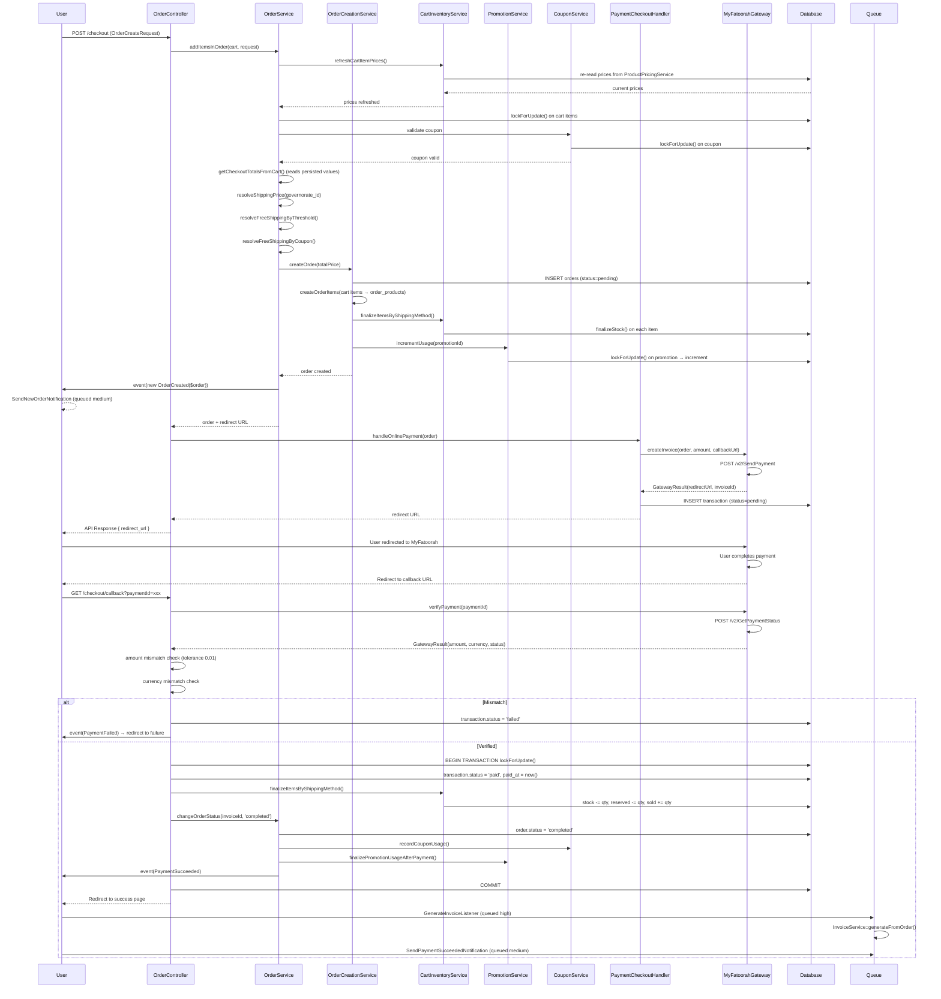

---

## 2. Checkout Flow — COD / Cashier

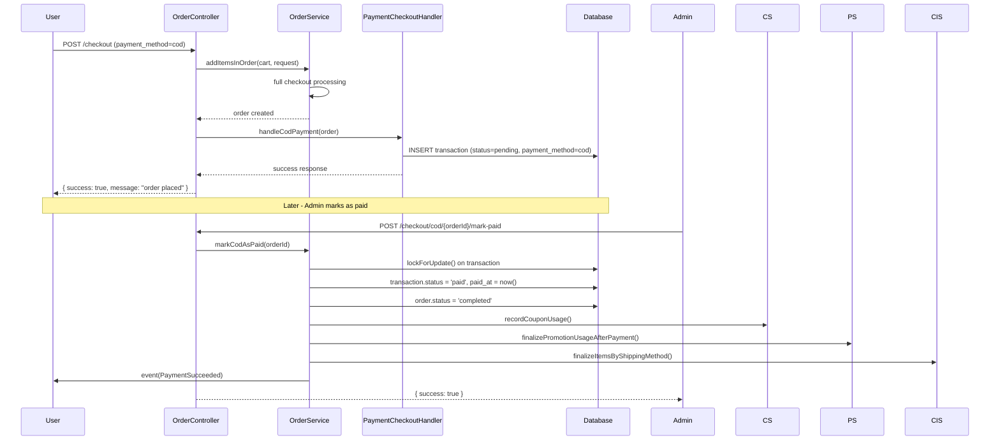

---

## 3. Cart — Add Item & Inventory Reservation

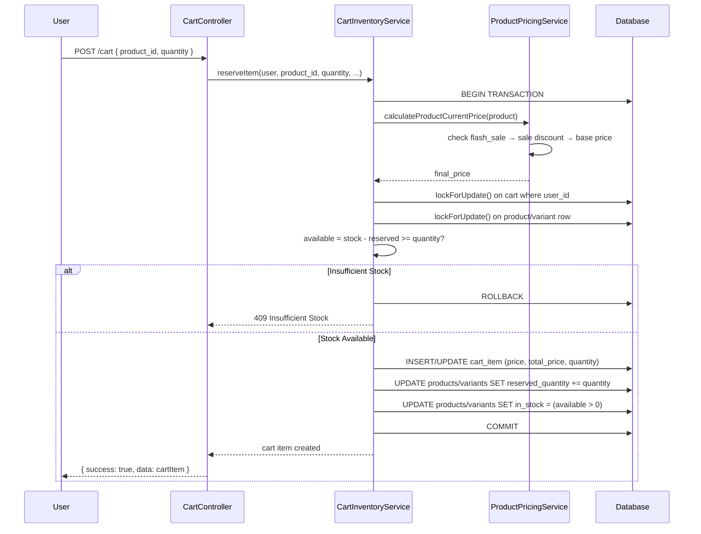

---

## 4. Coupon Application Flow

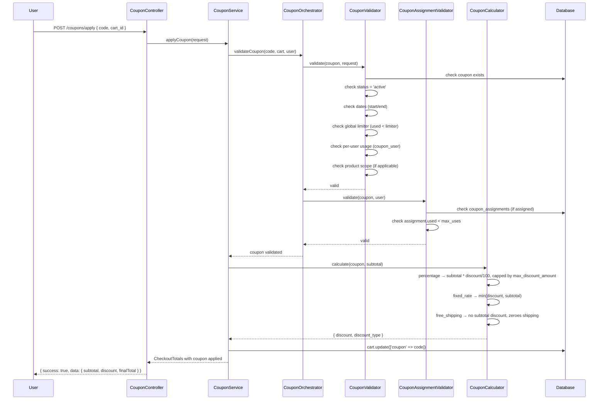

---

## 5. Promotion Application Flow

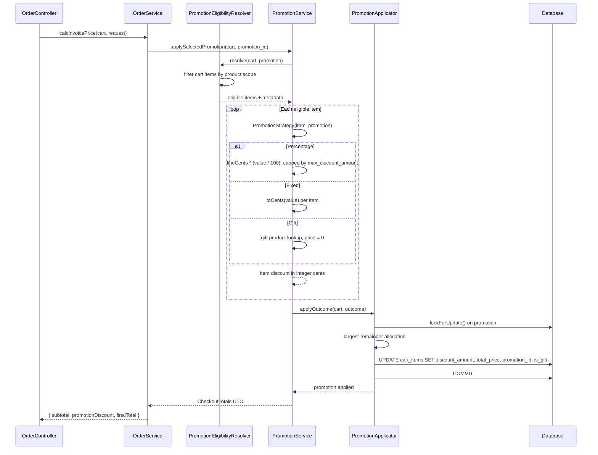

---

## 6. Payment Gateway Callback & Reconciliation

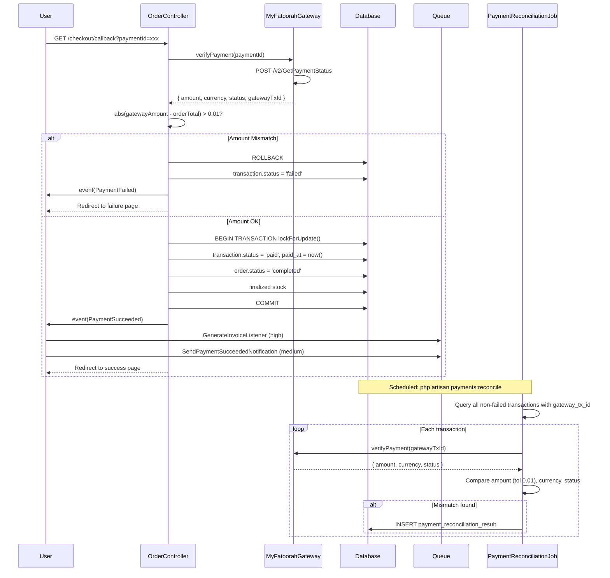

---

## 7. Cart Expiration & Order Cancellation

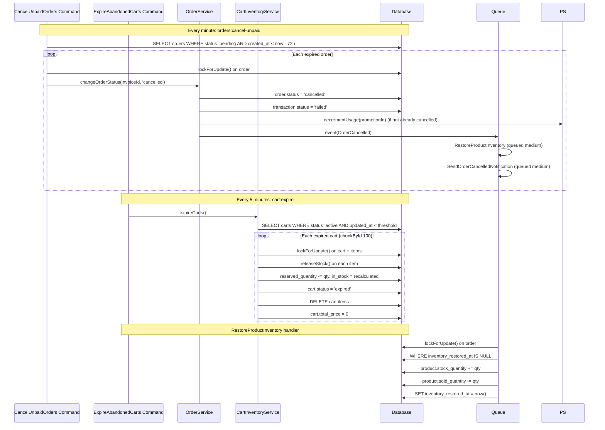

---

## 8. Invoice Generation & PDF Lifecycle

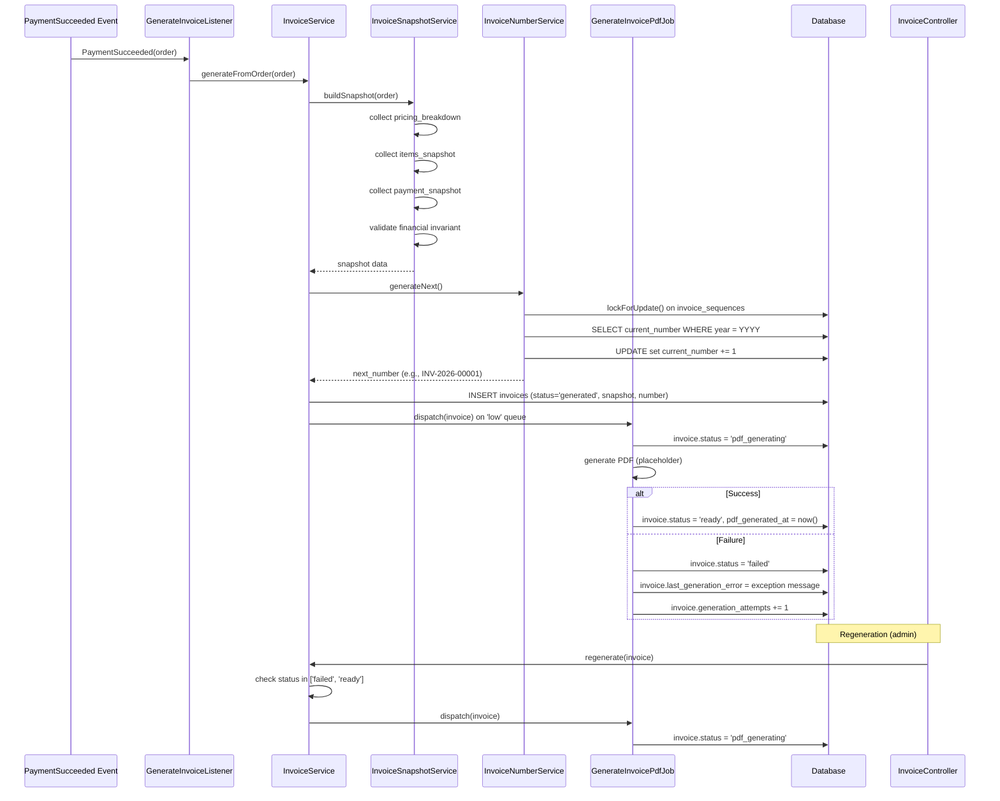

---

## 9. Refund Approval Flow

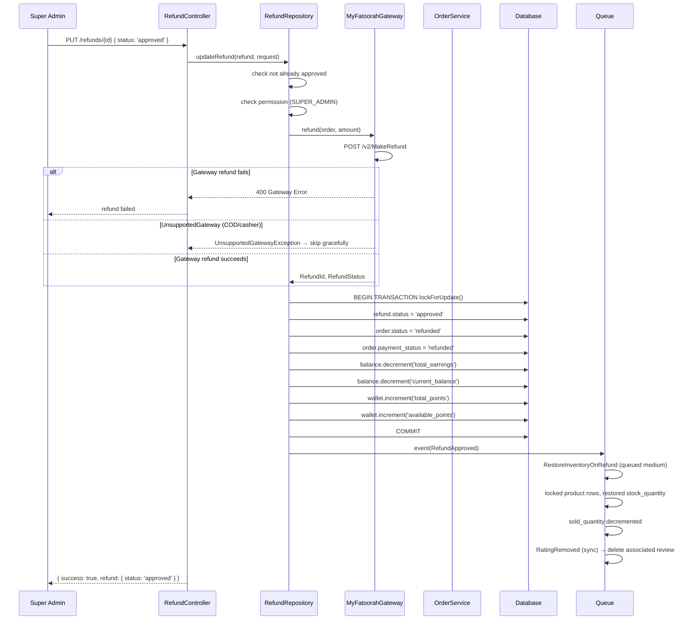

---

## 10. Full Order Lifecycle State Machine

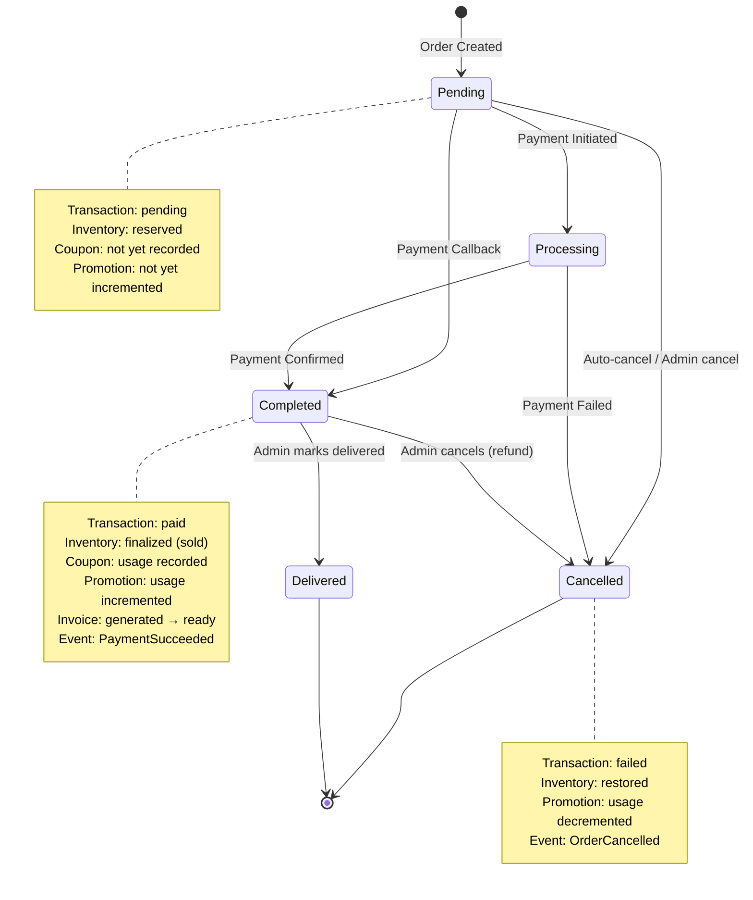

---

## 11. Inventory Quantity State Machine

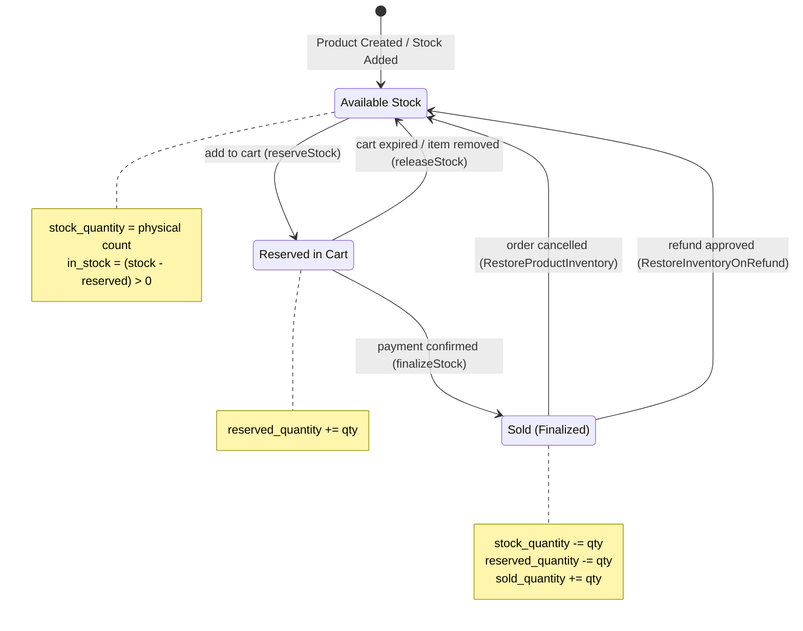

---

## 12. Transaction Lifecycle

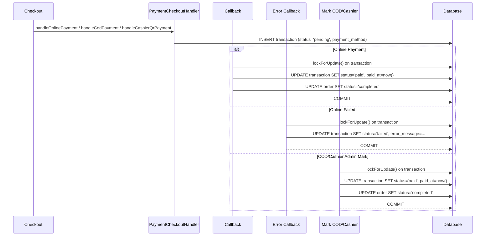

---

## 13. Fast Shipping Checkout vs Normal Checkout

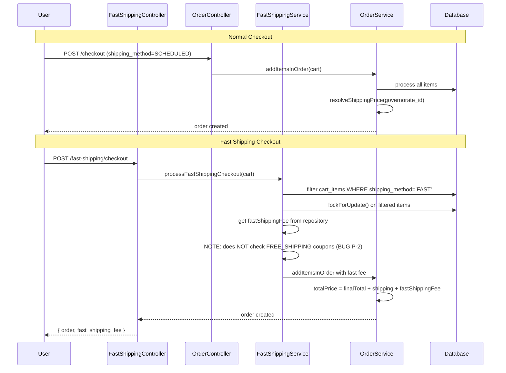
